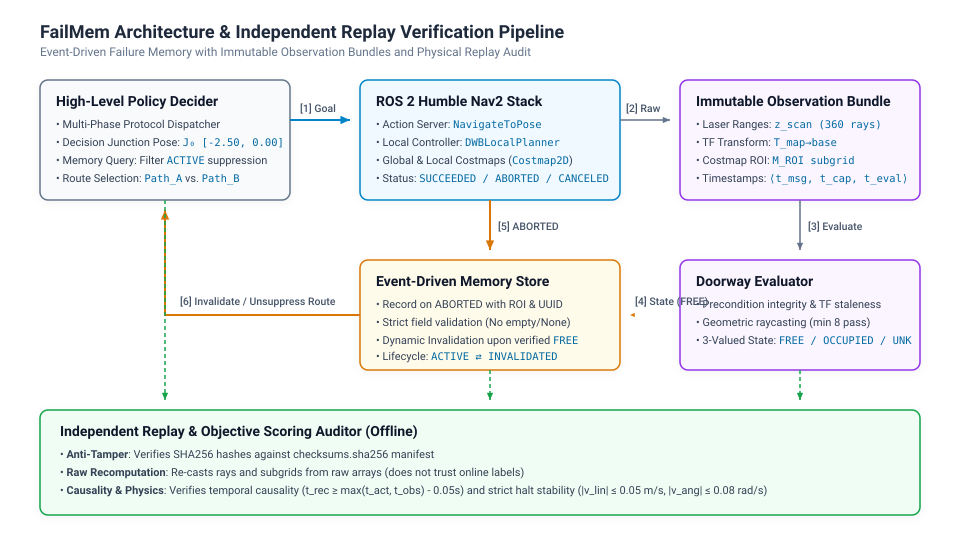
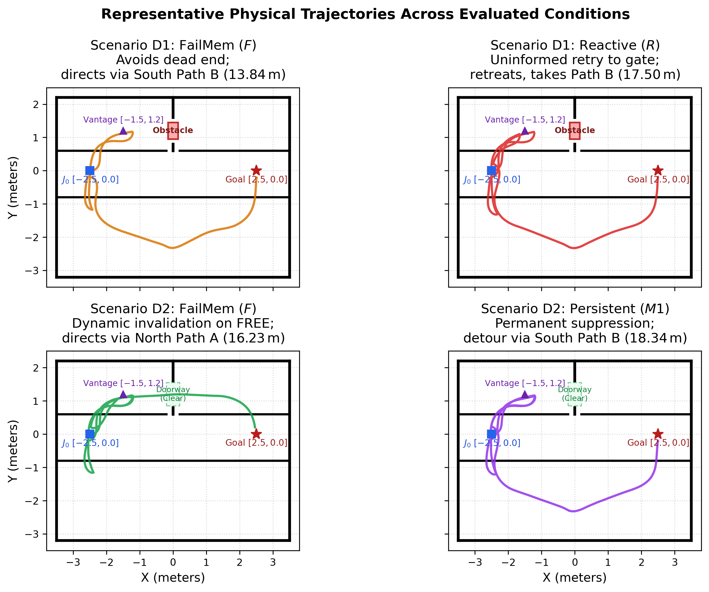

## Abstract

Autonomous mobile robots navigating dynamic indoor environments frequently encounter execution failures at physical chokepoints, narrow passages, and transient blockages. Standard navigation architectures (e.g., ROS 2 Nav2) employ reactive intra-episode recovery behaviors, yet they lack structured cross-episode memory indexing, leading to repetitive dead-end retries across subsequent tasks. While prior embodied agent frameworks (such as REFLECT) employ multi-modal experience summarization with LLMs for failure explanation, this work investigates event-driven failure recording, perception-driven invalidation, and offline replay auditing directly within the ROS 2 navigation stack. Specifically, we present **FailMem**, an event-driven, causally bound failure memory architecture for autonomous mobile robots. FailMem records immutable observation bundles comprising raw LiDAR range arrays, TF coordinate transforms, and raw 2D costmap regions-of-interest (ROIs), binding navigation failures to specific execution regions and action identities while dynamically invalidating suppression upon verified sensory clearance. To ensure rigorous scientific evaluation and eliminate unverified synthetic abstractions, we implement an independent replay audit pipeline that recomputes sensory metrics directly from raw physical observations against SHA256 checksum manifests. Evaluated across 30 physical simulation runs in Gazebo 11 with ROS 2 Humble Nav2 ($n=3$ per condition under sequential fixed-seed execution), FailMem ($F$) eliminates redundant dead-end traversals relative to a constrained reactive baseline ($R$), reducing total travel distance by $-18.5\%$ ($14.03\,\text{m}$ vs. $17.22\,\text{m}$) and total execution time by $-22.3\%$ ($109.5\,\text{s}$ vs. $141.0\,\text{s}$). Furthermore, dynamic memory invalidation saves $-11.0\%$ total distance relative to permanent suppression ($M1$) upon environmental recovery ($16.25\,\text{m}$ vs. $18.25\,\text{m}$). In our exploratory single-agent benchmark under static 2D geometric blockages, FailMem and a spatial observation caching baseline ($O$) exhibited identical high-level route choices with $<1\%$ differences in reported total travel distance and total execution duration ($14.03\,\text{m}$ vs. $13.95\,\text{m}$ in D1; $16.25\,\text{m}$ vs. $16.40\,\text{m}$ in D2). In this exploratory dataset, route choices were identical and showed no additional benefit of $F$ over $O$; general scenarios and statistical equivalence have not been verified. Finally, an exploratory feasibility check ($n=4$) on candidate action-conditioned execution ($H_1$) revealed that local planners negotiated narrow inflation margins without controller abortion (4/4 Nav2 `SUCCEEDED`, 3/4 verified strict physical arrival), indicating that the tested scenario did not establish executability divergence and providing concrete guidance for future action-profiled memory designs.

---

## 1. Introduction

Autonomous mobile robots deployed in complex indoor environments—such as fulfillment warehouses, clinical facilities, and office buildings—must repeatedly traverse structured corridors and shared doorways. In such environments, unmapped physical blockages (e.g., temporarily parked carts or closed security doors) frequently obstruct the nominal shortest path. Standard navigation systems, such as the ROS 2 Navigation Stack (Nav2) \cite{macenski2020marathon2, macenski2022ros2}, rely on layered 2D costmaps \cite{lu2014layered} and local recovery behaviors (e.g., in-place rotations, backup maneuvers, costmap clearing). While these recovery routines assist in negotiating transient obstacles during active trajectory tracking, they are bound to the execution lifetime of individual navigation actions. When a new navigation goal is dispatched from a distant decision junction, the robot has no structured representation of prior execution failures in occluded corridors, resulting in unguided retry traversals into known dead ends before local sensors can re-acquire line-of-sight.

To mitigate unguided re-exploration, two primary paradigms have been explored:

1. **Spatial Occupancy Mapping**: Updating global geometric representations (e.g., Costmap2D \cite{lu2014layered}, OctoMap \cite{hornung2013octomap}, Voxblox \cite{oleynikova2017voxblox}) as sensor observations reveal occupied space.
2. **Episodic Failure Memory & Verbal Reflection**: Storing execution traces, error diagnostics, or natural language self-reflections (e.g., Reflexion \cite{shinn2023reflexion}, REFLECT \cite{liu2023reflect}) to inform subsequent planning.

However, existing frameworks present key operational and methodological limitations. In embodied AI, verbal reflection mechanisms typically store unstructured natural language strings in prompt contexts without physical sensor postcondition verification or spatial costmap expiration rules. Furthermore, robotics evaluation historically suffers from reproducibility challenges when relying on synthetic 2D mock state machines that omit real controller oscillation, sensor noise, and lifecycle timing delays.

In this work, we present an auditable, event-driven failure memory framework and evaluate its behavior in physical ROS 2 / Gazebo simulation. Specifically, we provide:

1. **Authentic Action Client & Perception Architecture**: We implement FailMem on genuine ROS 2 Humble Nav2 action clients, capturing immutable observation bundles (untruncated laser scans, TF transforms, and raw 2D costmap ROI subgrids) prior to state classification.
2. **Independent Replay Audit Pipeline**: We implement an independent offline replay engine that reconstructs memory lifecycles and physical trajectories directly from raw serialized sensor records against SHA256 checksum manifests, validating chronological causality ($t_{\text{rec}} \ge \max(t_{\text{act}}, t_{\text{obs}}) - 0.05\,\text{s}$) and physical halt stability.
3. **Empirical Evaluation Across 30 Physical Runs**: Across 30 physical simulation runs in Gazebo 11 ($n=3$ per condition), we demonstrate that historical knowledge eliminates redundant dead-end exploration ($-18.5\%$ distance vs. Reactive $R$) and dynamic invalidation prevents permanent detour traps ($-11.0\%$ distance vs. Persistent $M1$).
4. **Calibrated Comparison with Spatial Caching**: We report that under static 2D geometric blockages, FailMem and spatial caching ($O$) produce identical route choices with $<1\%$ differences in reported total travel distance and total execution duration. In this exploratory dataset, route choices were identical and showed no additional benefit of $F$ over $O$; general scenarios and statistical equivalence have not been verified. An exploratory feasibility trial ($n=4$) on action-conditioned navigation ($H_1$) further shows that the candidate scenario did not establish executability divergence, clarifying the empirical boundaries for future action-profiled memory designs ($F2$).

---

## 2. Related Work & Mechanism Taxonomy

### 2.1 Spatial Occupancy Mapping & Dynamic Distance Fields
Layered 2D costmaps \cite{lu2014layered, macenski2020marathon2} maintain geometric obstacles by ray-casting sensor ranges into grid cells and propagating configuration-space inflation. 3D volumetric frameworks, such as OctoMap \cite{hornung2013octomap}, employ hierarchical octrees with discrete probabilistic voxel occupancy updates. In contrast, distance-field frameworks such as Voxblox \cite{oleynikova2017voxblox} incrementally construct continuous Euclidean Signed Distance Fields (ESDF) and Truncated Signed Distance Fields (TSDF) for smooth trajectory optimization. While spatial mapping accurately maintains geometric free and occupied space, it treats unobserved areas identically and does not capture action-specific execution failures (e.g., narrow doorpost inflation boundaries where space is free but specific controller trajectories abort).

### 2.2 Execution Monitoring & Plan Diagnosis
Deliberative robotics frameworks \cite{fikes1971strips, simmons1998xavier, ingrand2017deliberation} formalize plan execution monitoring and diagnostic repair. Modern navigation stacks \cite{macenski2020marathon2} execute recovery behaviors when local planners fail. However, standard recovery states are discarded upon goal termination, requiring explicit cross-phase or cross-task episodic memory stores to guide high-level routing.

### 2.3 LLM Self-Reflection & Agent Memory
Recent embodied AI systems investigate large language models for planning and error correction. Reflexion \cite{shinn2023reflexion} prompts LLMs with scalar task feedback to generate natural language self-reflections. Inner Monologue \cite{huang2023inner} integrates success detectors and scene descriptions into closed-loop prompt chains. REFLECT \cite{liu2023reflect} uses hierarchical multi-modal experience summarization with LLMs to generate structured failure explanations and plan corrections. While these methods demonstrate prompt-level flexibility, they focus on higher-level task reflection. FailMem complements these approaches by investigating event-driven failure recording, perception-driven invalidation, and offline replay auditing directly within the low-level ROS 2 action and costmap stack.

### 2.4 Experience-Based Planning & No-Good Learning
In motion planning, the Lightning framework \cite{berenson2012lightning} and Experience Graphs (E-Graphs) \cite{phillips2012egraphs} reuse libraries of prior successful paths to accelerate search. In discrete optimization, conflict-driven clause learning (e.g., GRASP \cite{marquessilva1999grasp}) records "no-goods" from search dead ends to prune infeasible branches. FailMem adapts the principle of negative constraint recording to mobile robot navigation with explicit sensor-verified invalidation.

```
+---------------------------------------------------------------------------------------------------+
|                                 Comparative Mechanism Taxonomy                                    |
+---------------------------------------------------------------------------------------------------+
| Paradigm               | Representation         | Grounding Level   | Invalidation Trigger        |
+------------------------+------------------------+-------------------+-----------------------------+
| Costmap2D / Nav2       | 2D Occupancy Grid      | Geometric cells   | Direct laser ray traversal  |
| OctoMap                | 3D Voxel Octree        | Discrete 3D voxels| Direct laser ray traversal  |
| Voxblox                | Continuous ESDF / TSDF | 3D Distance Field | Dynamic voxel integration   |
| Experience Graphs      | Path Waypoints / Graph | Discrete Path     | Collision check on repair   |
| Reflexion              | Natural Language Text  | Semantic tokens   | Manual context reset        |
| REFLECT                | Natural Language Text  | Multi-modal logs  | Session termination         |
| FailMem (Implemented)  | Event Tuple            | Raw sensor bundle | Sensor-verified FREE state  |
| FailMem F2 (Proposed)  | Profile Tuple          | Bundle + Profile  | Profile capability check    |
+---------------------------------------------------------------------------------------------------+
```

---

## 3. The FailMem Architecture & Verification Pipeline



### 3.1 Immutable Observation Bundles
Prior to evaluating passage clearance, FailMem constructs an immutable observation bundle $B$:
$$B = \langle \text{obs\_id}, \mathbf{z}_{\text{scan}}, \mathbf{T}_{\text{map}\to\text{base}}, \mathbf{M}_{\text{costmap\_ROI}}, t_{\text{msg}}, t_{\text{capture}}, t_{\text{eval}} \rangle$$
where $\mathbf{z}_{\text{scan}}$ is the raw range array, $\mathbf{T}_{\text{map}\to\text{base}}$ is the TF transformation, and $\mathbf{M}_{\text{costmap\_ROI}}$ is the extracted $2\text{D}$ subgrid matrix.

### 3.2 Geometric & Costmap Clearance Formulation
The passage state is evaluated according to the following strict hierarchical rules implemented in `src/doorway_evaluator.py`:

1. **Precondition Integrity Checks**:
   - TF translation and yaw must be valid finite numbers.
   - Timestamp alignment: $|t_{\text{tf}} - t_{\text{scan}}| \le 0.80\,\text{s}$.
   - Data freshness: $t_{\text{sim}} - t_{\text{tf}} \le 1.0\,\text{s}$ and $t_{\text{sim}} - t_{\text{scan}} \le 1.5\,\text{s}$.
   - Ray projection: Number of valid finite rays $N_{\text{valid}} > 0$.
   - Visibility: Number of rays intersecting doorway bounding box $N_{\text{intersect}} > 0$.
   - Costmap status (if provided): $N_{\text{total\_cells}} > 0$.
   If any precondition fails, $\text{State}(B) = \text{UNKNOWN}$.

2. **Classification Rules**:
   $$\text{State}(B) = \begin{cases} 
   \text{OCCUPIED}, & \text{if } N_{\text{hits\_inside}} \ge 5 \text{ or } N_{\text{costmap\_occupied\_cells}} > 0 \\ 
   \text{FREE}, & \text{if } N_{\text{hits\_inside}} = 0 \text{ and } N_{\text{pass\_through}} \ge 8 \text{ and } \text{CostmapCleared}(B) \\ 
   \text{UNKNOWN}, & \text{otherwise} 
   \end{cases}$$
   where $\text{CostmapCleared}(B) \iff (N_{\text{unknown\_cells}} = 0 \land N_{\text{occupied\_cells}} = 0)$ within the doorway ROI $[-0.15, 0.15, 0.95, 1.45]$.

### 3.3 Memory Lifecycle & Invalidation Mechanics
- **Failure Registration**: When chokepoint traversal fails in an occupied region, an active entry is committed:
  $$M = \langle \text{mem\_id}, t_{\text{fail}}, \text{goal\_uuid}, \text{action\_id}, \text{region\_id}, \mathbf{M}_{\text{costmap\_ROI}} \rangle$$
- **Dynamic Invalidation**: When subsequent perception produces $\text{State}(B) = \text{FREE}$ with evidence timestamp $t_{\text{free}} > t_{\text{fail}}$, the memory entry is marked $\text{INVALIDATED}$, unsuppressing the route.
- **Cross-Phase Scope Clarification**: In the current experimental implementation, history collection, memory creation, decision dispatch, and memory reset occur within a single experimental runner session across sequential phases. This establishes phase-to-phase memory transfer within an experimental run, and has not yet been benchmarked as a persistent multi-task database across separate OS daemon lifetimes.

### 3.4 Independent Replay Audit Pipeline
To eliminate reliance on self-reported runtime summaries, the independent replayer (`scripts/replay_and_score_p2c.py`):
1. Verifies SHA256 hashes of all serialized files against `checksums.sha256`;
2. Re-computes subgrid ROI cell counts and 3-valued perception directly from raw `subgrid_matrix` and laser scans;
3. Integrates continuous odometry trajectory samples to verify path length and physical halt stability;
4. Enforces chronological causality with a $0.05\,\text{s}$ tolerance window:
   $$t_{\text{rec}} \ge \max(t_{\text{tr1\_end}}, t_{\text{obs\_eval}}) - 0.05\,\text{s}, \quad t_{\text{inv}} \ge \max(t_{\text{fail}}, t_{\text{free\_eval}}) - 0.05\,\text{s}$$
   Replay rejects empty strings, missing fields, and `"unknown"` placeholder values.

---

## 4. Experimental Setup & Benchmarking Protocol

### 4.1 Physical Simulation Environment & Geometry
Simulations are conducted in ROS 2 Humble with Gazebo 11 simulating a TurtleBot3 Waffle robot in an asymmetric dual-path environment (`configs/p2c_dualpath_world.model`).
- **Path A (North Short Path)**: Protocol waypoint polyline length is $6.124\,\text{m}$ from Decision Junction $J_0 [-2.50, 0.00]$ to Goal $[2.50, 0.00]$ through a $0.80\,\text{m}$ doorway chokepoint at $y=1.20$.
- **Path B (South Bypass Detour)**: Protocol waypoint polyline length is $9.105\,\text{m}$ from $J_0$ to Goal via open corridor at $y=-2.40$.

### 4.2 Distance Metric Definitions
To prevent ambiguity across different evaluation granularities, distance metrics are defined as follows:
1. **Protocol Waypoint Polyline Length**: Ideal piecewise linear distance connecting defined route waypoints (Path A: $6.124\,\text{m}$, Path B: $9.105\,\text{m}$).
2. **Decision-Phase Traversed Distance**: Actual physical odometry distance traversed during Phase 2 after goal dispatch from Decision Junction $J_0$ (Path B direct: $\approx 7.54\,\text{m}$; Path A direct: $\approx 5.89\,\text{m}$).
3. **Total Episode Distance**: Cumulative odometry distance spanning both the Phase 1 historical observation/attempt leg and the Phase 2 decision navigation leg ($14.03\,\text{m}$ for D1 F/O, $17.22\,\text{m}$ for D1 R, $16.25\,\text{m}$ for D2 F, $18.25\,\text{m}$ for D2 M1).

### 4.3 Evaluated Scenarios & Methods
- **Scenario D0 (Unobstructed Baseline)**: Doorway is clear; robot navigates Path A without prior history.
- **Scenario D1 (Confirmed Blockage)**: Doorway is blocked by a physical box obstacle. Phase 1 traverses from $J_0$ to chokepoint approach waypoint $[-1.50, 1.20]$, encounters blockage, and retreats to $J_0$. Phase 2 evaluates routing dispatched from $J_0$.
- **Scenario D2 (Cleared / Restored)**: Following D1, the obstacle is removed. Phase 1 observes `FREE` doorway clearance from vantage waypoint $[-1.50, 1.20]$ and retreats to $J_0$. Phase 2 evaluates routing dispatched from $J_0$.

**Evaluated Methods**:
1. **Reactive Baseline ($R$)**: No cross-phase memory. In D1, enters Path A approach leg to gate waypoint `[-1.50, 1.20]`, detects blockage, and executes structured fallback retreat to $J_0$ before taking Path B. All methods share identical Nav2 costmap configurations.
2. **Spatial Observation Cache ($O$)**: Caches 2D geometric occupancy observed from vantage waypoint `[-1.50, 1.20]` during Phase 1. Evaluated at $J_0$ during Phase 2 route dispatch.
3. **FailMem ($F$)**: Event-driven failure memory with dynamic perception-driven invalidation.
4. **Persistent Suppression ($M1$)**: Static failure memory permanently suppressing Path A without dynamic invalidation.

### 4.4 Execution Constraints & Halt Stability
- **Sample Size & Order**: $n=3$ per condition, executed consecutively under fixed simulation seeds.
- **Budget**: Total episode simulation budget is $180.0\,\text{s}$.
- **Physical Halt Stability**: Upon goal completion, the robot must maintain linear velocity $|v_{\text{lin}}| \le 0.05\,\text{m/s}$ and angular velocity $|v_{\text{ang}}| \le 0.08\,\text{rad/s}$ over a nominal $2.0\,\text{s}$ stability recording window (with $2.3-2.4\,\text{s}$ sim time coverage in the active executor).

---

## 5. Empirical Results & Boundary Analysis

### 5.1 Condition-Level Aggregated Metrics

Table 1 presents condition-level performance across 30 physical simulation runs ($n=3$ per condition, reporting mean $\pm$ sample standard deviation with Bessel correction $ddof=1$).

<!-- TABLE:table1_condition_summary -->
| Scenario | Condition | $n$ | Actual Route | Dead-End Traversals | Decision Dist (m) | Decision Time (s) | Total Dist (m) | Total Time (s) | Replay Audit Pass |
| :--- | :--- | :---: | :--- | :---: | :---: | :---: | :---: | :---: | :---: |
| **D0** | $R$ | 3 | `Path_A` | 0.0 $\pm$ 0.0 | 6.160 $\pm$ 0.037 | 51.533 $\pm$ 1.656 | 6.160 $\pm$ 0.037 | 51.533 $\pm$ 1.656 | 3/3 (100\%) |
| **D0** | $O$ | 3 | `Path_A` | 0.0 $\pm$ 0.0 | 6.203 $\pm$ 0.007 | 49.967 $\pm$ 0.850 | 6.203 $\pm$ 0.007 | 49.967 $\pm$ 0.850 | 3/3 (100\%) |
| **D0** | $F$ | 3 | `Path_A` | 0.0 $\pm$ 0.0 | 6.196 $\pm$ 0.031 | 49.900 $\pm$ 0.458 | 6.196 $\pm$ 0.031 | 49.900 $\pm$ 0.458 | 3/3 (100\%) |
| **D1** | $R$ | 3 | `Path_A_then_Path_B` | 1.0 $\pm$ 0.0 | 10.816 $\pm$ 0.072 | 82.067 $\pm$ 4.394 | 17.220 $\pm$ 0.242 | 141.000 $\pm$ 5.910 | 3/3 (100\%) |
| **D1** | $O$ | 3 | `Path_B` | 0.0 $\pm$ 0.0 | 7.550 $\pm$ 0.052 | 50.033 $\pm$ 1.986 | 13.947 $\pm$ 0.070 | 108.700 $\pm$ 2.718 | 3/3 (100\%) |
| **D1** | $F$ | 3 | `Path_B` | 0.0 $\pm$ 0.0 | 7.536 $\pm$ 0.003 | 48.200 $\pm$ 0.954 | 14.027 $\pm$ 0.252 | 109.500 $\pm$ 1.572 | 3/3 (100\%) |
| **D2** | $R$ | 3 | `Path_A` | 0.0 $\pm$ 0.0 | 5.915 $\pm$ 0.044 | 49.567 $\pm$ 1.595 | 16.344 $\pm$ 0.032 | 148.167 $\pm$ 3.164 | 3/3 (100\%) |
| **D2** | $O$ | 3 | `Path_A` | 0.0 $\pm$ 0.0 | 5.939 $\pm$ 0.066 | 52.033 $\pm$ 1.747 | 16.396 $\pm$ 0.240 | 149.767 $\pm$ 0.551 | 3/3 (100\%) |
| **D2** | $F$ | 3 | `Path_A` | 0.0 $\pm$ 0.0 | 5.886 $\pm$ 0.022 | 51.100 $\pm$ 0.954 | 16.247 $\pm$ 0.098 | 151.100 $\pm$ 7.762 | 3/3 (100\%) |
| **D2** | $M1$ | 3 | `Path_B` | 0.0 $\pm$ 0.0 | 7.895 $\pm$ 0.023 | 51.300 $\pm$ 1.997 | 18.248 $\pm$ 0.094 | 148.833 $\pm$ 2.397 | 3/3 (100\%) |

### 5.2 Pairwise Contrasts & Trajectory Analysis

Table 2 presents key pairwise contrast comparisons across evaluated methods.

<!-- TABLE:table2_pairwise_contrasts -->
| Scenario | Comparison | Metric | Method A Mean | Method B Mean | Abs Diff ($A - B$) | Rel Diff (%) |
| :--- | :--- | :--- | :---: | :---: | :---: | :---: |
| **D1** | $F$ vs. $R$ | Total Dist (m) | 14.027 | 17.220 | -3.193 | **-18.5\%** |
| **D1** | $F$ vs. $R$ | Total Time (s) | 109.500 | 141.000 | -31.500 | **-22.3\%** |
| **D1** | $O$ vs. $R$ | Total Dist (m) | 13.947 | 17.220 | -3.273 | **-19.0\%** |
| **D1** | $O$ vs. $R$ | Total Time (s) | 108.700 | 141.000 | -32.300 | **-22.9\%** |
| **D1** | $F$ vs. $O$ | Total Dist (m) | 14.027 | 13.947 | +0.080 | +0.6\% |
| **D1** | $F$ vs. $O$ | Total Time (s) | 109.500 | 108.700 | +0.800 | +0.7\% |
| **D2** | $F$ vs. $M1$ | Total Dist (m) | 16.247 | 18.248 | -2.000 | **-11.0\%** |
| **D2** | $F$ vs. $M1$ | Total Time (s) | 151.100 | 148.833 | +2.267 | +1.5\% |
| **D2** | $F$ vs. $O$ | Total Dist (m) | 16.247 | 16.396 | -0.149 | -0.9\% |
| **D2** | $F$ vs. $O$ | Total Time (s) | 151.100 | 149.767 | +1.333 | +0.9\% |



1. **Elimination of Redundant Dead-End Exploration ($F$ vs. $R$)**: In D1, FailMem ($F$) eliminates redundant entrance into the blocked corridor ($0.0$ vs. $1.0$ dead ends), reducing total distance by $-18.5\%$ and time by $-22.3\%$ relative to Reactive $R$. Note that $R$'s dead-end traversal represents an unguided retry traversal to the entrance waypoint, not physical collision or Nav2 crash.
2. **Prevention of Detour Overhead ($F$ vs. $M1$)**: In D2, dynamic invalidation upon observing `FREE` unsuppresses Path A, saving $2.00\,\text{m}$ ($-11.0\%$) total distance relative to persistent suppression ($M1$). Total execution times remain comparable ($151.1\,\text{s}$ vs. $148.8\,\text{s}$).
3. **Comparison with Spatial Caching in Static 2D Geometry ($F$ vs. $O$)**: In both D1 and D2, FailMem ($F$) and Spatial Cache ($O$) selected identical topological routes. *本次探索性数据中路线选择相同，未显示 F 的额外收益；尚未进行统计等效或一般化验证。*

### 5.3 Feasibility Check for Action-Conditioned Navigation ($H_1$)

To test whether action configurations (aligned $a_{\text{aligned}}$ vs. doorpost boundary-biased oblique $a_{\text{oblique}}$) create executability differences in an unobstructed doorway, a fixed 4-run feasibility check was executed (`reports/evidence/p2d_h1_feasibility/`).

<!-- TABLE:table3_h1_feasibility -->
| Run Name | Action Profile | Target Goal | Doorway Perception | Nav2 Status (Code) | Est. Nav2 Nav Time ($s$) | Assumed Settling ($s$) | Stability Window ($s$) | Total Sim Duration ($s$) | Physical Arrival Verified |
| :--- | :--- | :--- | :---: | :---: | :---: | :---: | :---: | :---: | :---: |
| `H1_aligned_run1` | `act_aligned` | `[1.50, 1.20, 0.0]` | `FREE` (23 rays) | `SUCCEEDED` (4) | $13.4$ (est.) | $3.0$ (nom.) | $2.4$ | $18.8$ | **False** (excess av: 0.1068 > 0.08) |
| `H1_aligned_run2` | `act_aligned` | `[1.50, 1.20, 0.0]` | `FREE` (22 rays) | `SUCCEEDED` (4) | $13.4$ (est.) | $3.0$ (nom.) | $2.4$ | $18.8$ | **True** |
| `H1_oblique_run1` | `act_oblique` | `[0.50, 0.88, 0.0]` | `FREE` (23 rays) | `SUCCEEDED` (4) | $11.1$ (est.) | $3.0$ (nom.) | $2.3$ | $16.4$ | **True** |
| `H1_oblique_run2` | `act_oblique` | `[0.50, 0.88, 0.0]` | `FREE` (22 rays) | `SUCCEEDED` (4) | $11.0$ (est.) | $3.0$ (nom.) | $2.3$ | $16.3$ | **True** |

*Findings & Decision*:
- Nav2 returned `SUCCEEDED` (status code 4) in all 4/4 runs; strict physical arrival was verified in 3/4 runs (`H1_aligned_run1` failed angular velocity halt threshold during the stability window).
- Nav2's `DWBLocalPlanner` successfully navigated the doorpost inflation boundary without planner abortion in both oblique runs.
- **Conclusion**: *本次候选场景未建立预期的动作可执行性差异，因此停止本轮 H1 探索；不构成对一般动作条件失败记忆假设的证伪。*

---

## 6. Threats to Validity & Limitations

1. **Exploratory Sample Size**: The 30-run comparative pilot ($n=3$ per condition) serves as an exploratory demonstration of mechanism functioning and auditability; it does not constitute large-sample asymptotic hypothesis testing.
2. **Simulation Fidelity**: Evaluated in Gazebo 11 simulation with nominal sensor models. Hardware deployments with real-world sensor dropout, dynamic obstacles, and adversarial conditions are subject to future research.
3. **Conceptual Extensions ($F2, O+$)**: Action-profiled failure memory ($F2$) and backoff spatial caching ($O+$) are formalized as conceptual models in project documentation but have not yet been evaluated in simulation.

---

## 7. Conclusion

This paper presented FailMem, an event-driven failure memory architecture for autonomous mobile robots. By binding execution failures to immutable observation bundles and providing an independent replay audit pipeline, FailMem establishes rigorous standards for reproducible robotics evaluation. Our empirical findings demonstrate that failure memory eliminates redundant dead-end exploration relative to reactive baselines and prevents permanent detour traps upon environmental recovery, while exhibiting identical route selection with spatial caching under the tested static 2D geometry. These findings define concrete experimental benchmarks and provide a solid foundation for future research in action-conditioned and multi-agent failure memory systems.

---

## References

\bibliographystyle{IEEEtran}
\bibliography{references}
