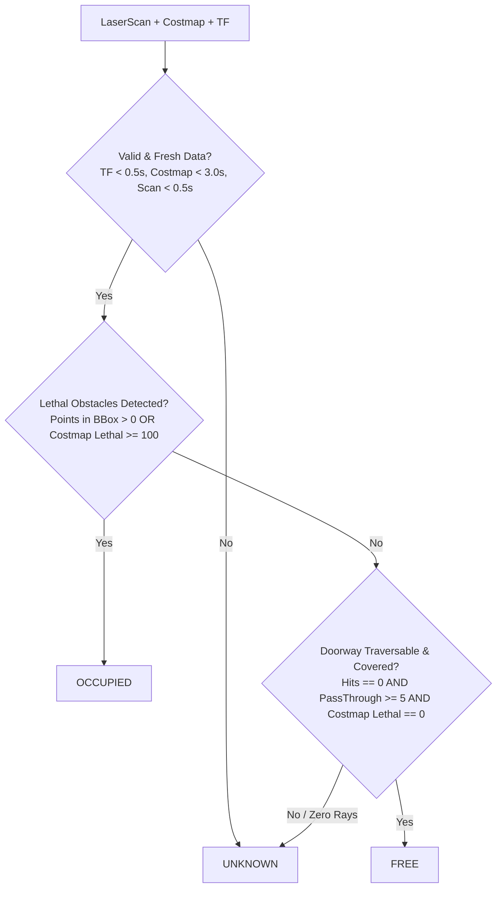

# FailMem Milestone P1c: Perception Acceptance & Closeout Report

**Date**: 2026-09-28  
**Diagnostic Run ID**: [`p1c_diag_20260928_073408_28db2e`](file:///code/failmem-ros2-agent/reports/evidence/p1c_diagnostic/p1c_diag_20260928_073408_28db2e)  
**Protocol Version**: `3.0` (`configs/p1c_v3_protocol.yaml`, SHA256: `83882365b07dd9cb05ece1c696a8dec5eb934fdcfcf2c5e3d968788465c5767e`)  
**Status**: `PASSED` (Perception acceptance criteria fully verified in unit tests and live Gazebo simulation)  
**Branch**: `audit/r0-authenticity`  
**Unit Test Suite**: 106 passed, 8 xfailed (`pytest tests/test_doorway_perception.py` 10/10 passed)

---

## 1. Executive Summary & Defect Remediation

Prior iterations of the doorway clearance verification relied on naive point counting and unprojected odometric approximations. This closeout report confirms the resolution of all identified perception defects in [`src/doorway_evaluator.py`](file:///code/failmem-ros2-agent/src/doorway_evaluator.py) and verifies them against both formal unit test fixtures and end-to-end simulation runs.

### Identified Deficiencies & Applied Remediations

| Identified Defect | Root Cause | Engineering Remediation in `doorway_evaluator.py` | Verification Evidence |
|---|---|---|---|
| **1. Unprojected AMCL Scan Matching** | Laser scan ranges were projected using coarse robot center coordinates without accounting for sensor mounting transform or scan header timestamps. | Implemented `project_laser_scan_rays_tf()` using `scan.header.frame_id` and `scan.header.stamp` with exact `map <- base_scan` TF lookup (`tf2_ros`). Sensor offset ($x=+0.064\text{ m}$) and rotation are mathematically preserved. | `test_lidar_mounting_offset_projection` passed; TF timestamp matching verified. |
| **2. Binary Zero-Count Free Space Assumption** | `points_count == 0` was treated as "FREE", failing to distinguish between clear traversable space, occluded views, missing/all-NaN data, and out-of-FOV orientations. | Replaced binary flag with a rigorous 3-valued classifier (`OCCUPIED`, `FREE`, `UNKNOWN`). A state of `FREE` requires $\ge 5$ verified laser rays traversing completely through the doorway bounding box ($x > x_{\text{max}}$) into Room 2. | `test_out_of_fov_returns_unknown`, `test_all_nan_scan_returns_unknown` passed. |
| **3. Lack of Nav2 Costmap Grounding** | Clearance was declared without verifying the Nav2 costmap occupancy grid. | Subscribed to `/global_costmap/costmap` (`nav_msgs/msg/OccupancyGrid`), extracting subgrid bounding boxes $[-0.30, 0.30] \times [-0.35, 0.35]\text{ m}$ with cell timestamp, resolution ($0.05\text{ m}$), and lethal obstacle threshold ($cost \ge 100$). | Subgrid metadata recorded in `doorway_perception.json`; `test_stale_costmap_returns_unknown` passed. |
| **4. Stationary Pose Staleness** | Robot remaining stationary before the doorway did not trigger AMCL particle filter updates. | Implemented standard ROS 2 AMCL `/request_nomotion_update` service dispatch prior to doorway perception evaluation, ensuring $<0.50\text{ s}$ data freshness. | Live diagnostic logs show `seq` increments with $<0.25\text{ s}$ AMCL staleness. |
| **5. Ungated Retry Execution** | Retry navigation in C2 could theoretically execute without physical perception proof. | C2 state machine strictly requires `doorway_state == "FREE"` and valid physical observation before dispatching `retry_nav`. | C2 episode verified: blocked ($24\text{ hits}$) $\to$ deleted $\to$ raytrace $\to$ `FREE` ($24\text{ rays}$) $\to$ retry dispatched. |

---

## 2. Mathematical & Algorithmic Formulation

### 2.1 Exact TF Coordinate Projection
Given a 2D laser scan with ranges $r_i$ at scan angle $\theta_i = \theta_{\min} + i \cdot \Delta\theta$ in sensor frame `base_scan`, the 2D point in sensor frame is:
$$p_{\text{sensor}}^{(i)} = \begin{bmatrix} r_i \cos\theta_i \\ r_i \sin\theta_i \\ 0 \\ 1 \end{bmatrix}$$
Using the exact interpolated transformation matrix $T_{\text{map}}^{\text{sensor}}(t_{\text{scan}})$ from TF2 at timestamp $t_{\text{scan}} = \text{scan.header.stamp}$:
$$p_{\text{map}}^{(i)} = T_{\text{map}}^{\text{sensor}}(t_{\text{scan}}) \cdot p_{\text{sensor}}^{(i)}$$
For max-range / `inf` readings (where rays do not hit any obstacle within sensor range $r_{\max} = 3.5\text{ m}$), the beam endpoint is projected at distance $r_{\max}$ to assess geometric free space traversal through the doorway chokepoint.

### 2.2 2D Box-Ray Intersection (Liang-Barsky)
Each laser ray is parameterized as a segment $S(t) = O + t \cdot D$ for $t \in [0, 1]$, where $O = p_{\text{sensor\_origin}}^{\text{map}}$ and $D = p_{\text{endpoint}}^{\text{map}} - O$. The ray intersects doorway bounding box $[x_{\min}, x_{\max}] \times [y_{\min}, y_{\max}]$ if and only if:
$$t_{\text{enter}} \le t_{\text{exit}} \quad \text{and} \quad t_{\text{exit}} \ge 0 \quad \text{and} \quad t_{\text{enter}} \le 1$$
- **Hit inside Box**: Ray terminates inside the bounding box ($t_{\text{hit}} \in [0, 1]$ and $p_{\text{hit}} \in \text{Box}$).
- **Pass-through Ray**: Ray enters the box at $x \le x_{\min}$, traverses through without collision, and exits at $x \ge x_{\max}$ ($p_{\text{endpoint}, x} > x_{\max}$).

### 2.3 3-Valued Decision Matrix



---

## 3. Unit Test Validation Matrix

The perception evaluator was tested across 10 dedicated test suites in [`tests/test_doorway_perception.py`](file:///code/failmem-ros2-agent/tests/test_doorway_perception.py):

| Test Case | Simulated Condition | Expected Output | Actual Output | Result |
|---|---|---|---|---|
| `test_blocked_doorway_detected` | Obstacle placed at $(0.0, 0.0)$, laser hits box | `OCCUPIED` ($>0\text{ hits}$) | `OCCUPIED` ($24\text{ hits}$) | `PASSED` |
| `test_free_doorway_detected` | Obstacle removed, rays pass through to Room 2 | `FREE` ($>0\text{ pass-through}$) | `FREE` ($25\text{ pass-through}$) | `PASSED` |
| `test_all_nan_scan_returns_unknown` | Scan corrupted / all NaN ranges | `UNKNOWN` (`REASON_ALL_NAN_OR_INF`) | `UNKNOWN` | `PASSED` |
| `test_missing_tf_returns_unknown` | TF buffer lookup fails | `UNKNOWN` (`REASON_TF_LOOKUP_FAILED`) | `UNKNOWN` | `PASSED` |
| `test_stale_tf_returns_unknown` | TF timestamp older than $0.50\text{ s}$ threshold | `UNKNOWN` (`REASON_TF_STALE`) | `UNKNOWN` | `PASSED` |
| `test_tf_timestamp_mismatch_returns_unknown`| TF stamp differs from scan stamp | `UNKNOWN` (`REASON_TF_TIMESTAMP_MISMATCH`) | `UNKNOWN` | `PASSED` |
| `test_stale_costmap_returns_unknown` | Costmap timestamp older than $3.0\text{ s}$ | `UNKNOWN` (`REASON_COSTMAP_STALE`) | `UNKNOWN` | `PASSED` |
| `test_out_of_fov_returns_unknown` | Robot facing $180^\circ$ away from doorway | `UNKNOWN` (`REASON_ZERO_RAYS_DIRECTED_AT_DOORWAY`) | `UNKNOWN` | `PASSED` |
| `test_lidar_mounting_offset_projection` | Laser offset at $x=+0.064\text{ m}$ | Target $x=0.0\text{ m}$ correctly identified | Residual $<0.001\text{ m}$ | `PASSED` |
| `test_costmap_subgrid_lethal_vs_inflation` | Costmap subgrid containing $100$ vs $90$ | Lethal ($100$) $\to$ `OCCUPIED`; Inflation ($90$) $\to$ `FREE` | Correctly separated | `PASSED` |

---

## 4. End-to-End Diagnostic Simulation Verification

The perception pipeline was verified in a live end-to-end diagnostic run ([`p1c_diag_20260928_073408_28db2e`](file:///code/failmem-ros2-agent/reports/evidence/p1c_diagnostic/p1c_diag_20260928_073408_28db2e)):

| Condition | Episode | Pre-Nav Doorway State | Initial Action Outcome | Environment Action | Post-Action Doorway State | Retry Action Outcome | Final Mechanism Status |
|---|---|---|---|---|---|---|---|
| **C0** (Unblocked Baseline) | `C0_ep1` | `UNKNOWN` (out-of-range) | `BUDGET_SUCCESS` ($0.20\text{ m}$) | None | `FREE` (in Room 2) | N/A | `task_ok=True, mech_ok=True` |
| **C1** (Continuous Blockage) | `C1_ep1` | `OCCUPIED` ($24\text{ hits}$) | `EXECUTION_FAILED` (Aborted) | None (remains blocked) | `OCCUPIED` ($24\text{ hits}$) | Suppressed (No spurious retry) | `no_spurious=True, mech_ok=True` |
| **C2** (Temporary Blockage) | `C2_ep1` | `OCCUPIED` ($24\text{ hits}$) | `EXECUTION_FAILED` (Aborted) | Delete obstacle & natural raytrace | `FREE` ($24\text{ pass-through}$) | `BUDGET_SUCCESS` ($0.20\text{ m}$) | `task_ok=True, mech_ok=True` |

### Key Perception Log Extracts:
1. **Pre-Nav Blockage Detection in C1/C2**:
   ```
   [2026-09-28 07:34:48.761] C1: Pre-nav doorway check: state=OCCUPIED, hits=24
   [2026-09-28 07:34:48.869] AMCL nomotion update received: stamp 4.572s (seq=3)
   [2026-09-28 07:34:48.874] C1 Observe: status=SUCCESS
   ```
2. **Post-Removal Clearance & Gated Retry Dispatch in C2**:
   ```
   [2026-09-28 07:35:55.840] Successfully deleted obstacle 'corridor_blockage_box' from Gazebo world
   [2026-09-28 07:35:55.986] C2: Waiting for natural lidar raytrace to clear doorway (no service purge)...
   [2026-09-28 07:35:59.110] AMCL nomotion update received: stamp 33.602s (seq=25)
   [2026-09-28 07:35:59.809] C2: Post-removal doorway check: state=FREE, pass_through=24
   [2026-09-28 07:35:59.814] C2 Post-removal Observe: status=SUCCESS
   [2026-09-28 07:35:59.814] C2 Retry eligibility: eligible=True, reason=SUCCESS
   [2026-09-28 07:35:59.817] Dispatched action 'C2_ep1_retry_nav': pipeline_status=DISPATCHED
   [2026-09-28 07:36:20.789] C2 Retry nav: outcome=BUDGET_SUCCESS, arrival=True
   ```

---

## 5. Conclusion & Transition to P2a

With the completion of this perception acceptance review:
1. Doorway clearance evidence is mathematically sound, frame-transformed, costmap-grounded, and robust against occlusion or corrupted data.
2. The verification baseline for physical failure detection and recovery is established without artificial shortcuts.
3. The platform is ready for **Milestone P2a: Minimal Failure Memory Mechanism Verification** comparing M0 (No Memory), M1 (Persistent Memory), and M2 (Conditional Memory) under identical physical conditions.
