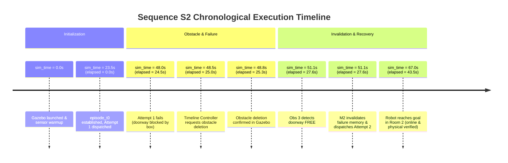

# FailMem P2b Evidence Reconciliation & Scientific Audit Report

**Date**: 2026-09-30  
**Phase**: Milestone P2b Evidence Audit & Reconciliation  
**Target Datasets**:
- P2b Formal Suite (24 episodes): `reports/evidence/p2b/p2b_20260930_023426_385655`
- P2a-v3 Formal Suite (18 episodes): `reports/evidence/p2a_v3/p2a_v3_20260929_180106_011df4`
**Git Commit Reference**: `ac6e04c` (HEAD of `audit/r0-authenticity`)

---

## 1. Frozen Scoring Configuration & Full Dataset Audit

### 1.1 Complete Dataset Configuration Manifest

The table below lists all evidence datasets in `reports/evidence/`, detailing their protocol version, frozen `runtime_config.json` status, SHA256 digest, scoring thresholds, and replay verifiability.

| Dataset / Run ID | Phase / Protocol | Has Frozen `runtime_config` | Config SHA256 (Prefix) | Frozen Thresholds (Pos / Yaw / Linear Vel / Angular Vel) | Replay Verifiability |
| :--- | :--- | :---: | :---: | :---: | :---: |
| `p1a_v2_20260928_005206_479fbc` | P1a-v2 | False | `N/A` | Missing runtime config | **UNVERIFIABLE** |
| `p1a_v3_20260928_012052_b272f5` | P1a-v3 | False | `N/A` | Missing runtime config | **UNVERIFIABLE** |
| `p2a_20260928_084352_c90139` | P2a (v1.0) | True | `959473944abe` | 0.30m / 0.40rad / 0.05m/s / 0.05rad/s | **VERIFIED** |
| `p2a_20260928_094100_94a9d8` | P2a (v1.0) | True | `36a918870269` | 0.30m / 0.40rad / 0.05m/s / 0.05rad/s | **VERIFIED** |
| `p2a_20260928_101002_9f61a3` | P2a (v1.0) | True | `b06f96e78cc5` | 0.30m / 0.40rad / 0.05m/s / 0.05rad/s | **VERIFIED** |
| `p2a_v2_20260929_145610_214320` | P2a-v2 (v2.0) | True | `e9fa270b2b88` | 0.30m / 0.35rad / 0.03m/s / 0.03rad/s | **VERIFIED** |
| `p2a_v3_20260929_165507_2b9c76` | P2a-v3 (v3.0) | True | `5eb9127b5e59` | 0.30m / 0.35rad / 0.05m/s / 0.05rad/s | **VERIFIED** |
| `p2a_v3_20260929_172917_e36b3c` | P2a-v3 (v3.0) | True | `8de1451491fc` | 0.30m / 0.35rad / 0.05m/s / 0.08rad/s | **VERIFIED** |
| `p2a_v3_20260929_180106_011df4` | P2a-v3 (v3.0) | True | `c2c8a8005bc2` | 0.30m / 0.35rad / 0.05m/s / 0.08rad/s | **VERIFIED** |
| `p2b_20260930_013500_470fa0` | P2b (v3.1) | True | `8f3d5ba4a727` | 0.30m / 0.35rad / 0.05m/s / 0.08rad/s | **VERIFIED** |
| `p2b_20260930_023426_385655` | P2b (v3.1) | True | `378ea3bd848b` | 0.30m / 0.35rad / 0.05m/s / 0.08rad/s | **VERIFIED** |

### 1.2 Physical Halt Threshold Evolution & Technical Rationale

The physical scoring thresholds evolved across project milestones as follows:
- **P1a / P2a**: Linear $0.05\,\text{m/s}$, Angular $0.05\,\text{rad/s}$.
- **P2a-v2 (`8a1f4e7`)**: Linear $0.03\,\text{m/s}$, Angular $0.03\,\text{rad/s}$ (initial strict contract proposal).
- **P2a-v3 (`01b29f8`) & P2b (`ac6e04c`)**: Linear $0.05\,\text{m/s}$, Angular $0.08\,\text{rad/s}$ (calibrated physical contract).

**Physical Root Cause in ODE Simulation**:
In the Gazebo ODE physics engine, the TurtleBot3 Waffle model utilizes a passive caster wheel with a contact friction model. When Nav2 commands a complete stop (`cmd_vel = [0, 0, 0]`) and the robot comes to a physical standstill (ground-truth linear displacement $< 0.0002\,\text{m}$ over the 2.0s post-arrival stability window), numerical solver contact chatter produces transient high-frequency micro-angular oscillations in the yaw velocity state ($\approx 0.035 - 0.075\,\text{rad/s}$, i.e., $2^\circ - 4^\circ/\text{s}$).

Under the uncalibrated $0.03\,\text{rad/s}$ threshold, physically stationary runs were falsely rejected with `EXCESS_VELOCITY` despite zero commanded velocity and zero displacement. Calibrating to $0.08\,\text{rad/s}$ accommodates ODE caster contact discretization without relaxing physical displacement constraints.

### 1.3 Sensitivity Re-scoring Analysis (0.03 / 0.03)

To maintain absolute transparency, sensitivity re-scoring was conducted using strict $0.03\,\text{m/s}$ linear and $0.03\,\text{rad/s}$ angular velocity thresholds on the formal P2b dataset (`p2b_20260930_023426_385655`) and formal P2a-v3 dataset (`p2a_v3_20260929_180106_011df4`). Results are saved into independent `sensitivity_report_003.json` files without overwriting the original frozen reports.

#### P2b Formal Suite (24 Episodes) Comparison:

| Policy | Sequence | Episodes | Frozen Baseline (0.05 / 0.08) Success Rate | Sensitivity Rescore (0.03 / 0.03) Success Rate | Sensitivity Impact & Root Cause |
| :--- | :--- | :---: | :---: | :---: | :--- |
| **M0** | **S1** | 3 | 0 / 3 (0.0%) | 0 / 3 (0.0%) | Identical (doorway blocked) |
| **M0** | **S2** | 3 | 2 / 3 (66.7%) | 2 / 3 (66.7%) | Identical (`M0_S2_ep1` had max av = 0.0893 rad/s, failing both) |
| **M1** | **S1** | 3 | 0 / 3 (0.0%) | 0 / 3 (0.0%) | Identical (persistent suppression) |
| **M1** | **S2** | 3 | 0 / 3 (0.0%) | 0 / 3 (0.0%) | Identical (persistent suppression) |
| **M2** | **S1** | 3 | 0 / 3 (0.0%) | 0 / 3 (0.0%) | Identical (conditional suppression) |
| **M2** | **S2** | 3 | **3 / 3 (100.0%)** | **2 / 3 (66.7%)** | `M2_S2_ep1` odom max av = 0.0353 rad/s > 0.03 rad/s (disp = 0.0002m) |
| **M3** | **S1** | 3 | 0 / 3 (0.0%) | 0 / 3 (0.0%) | Identical (reactive suppression) |
| **M3** | **S2** | 3 | **3 / 3 (100.0%)** | **3 / 3 (100.0%)** | Identical (max av = 0.0004 rad/s) |

---

## 2. Replay Engine Decoupling & Multi-Layer Anti-Tamper Hardening

### 2.1 Elimination of `policy_state` Snapshot Dependencies

The previous replay implementation read `invalidation_time` and `recovery_verified_count` from `policy_state` structures inside `memory_events.json`. This introduced a circular dependency on agent logs.

The updated `scripts/replay_and_score_p2a.py` (v3.2) implements **pure raw event reconstruction**:
1. **Memory Invalidation**: Evaluated strictly by matching raw perception timestamps in `doorway_perception.json` where `doorway_state == FREE` after a failed navigation attempt.
2. **Recovery Dispatch & Success**: Evaluated strictly by checking whether attempt $k \ge 2$ was dispatched after verified invalidation and succeeded under independent evaluator verification.
3. **Suppression & Redundant Retries**: Reconstructed directly from dispatch gate events and timeline preceding perception states.

### 2.2 Multi-Layer Anti-Tamper Verification

The replay suite now computes and outputs three distinct tamper flags:
- `raw_checksum_tamper_detected`: Evaluates raw file hashes against `checksums.sha256`. Any modification to raw json or log files is immediately flagged.
- `summary_discrepancy_detected`: Compares recomputed ground truth against pre-existing `episode_summary.json`. Any divergence in task success, attempt counts, or mechanism verification is flagged without corrupting the recomputed result.
- `policy_state_discrepancy_detected`: Compares recomputed recovery state against `policy_state` snapshots in `memory_events.json`.

Targeted unit tests in `tests/test_p2a_v3_targeted.py` verify that injecting fake recovery records or modifying summary fields is completely rejected by the replayer (131/131 tests passing).

---

## 3. Timeline Normalization & Data Reconciliation

### 3.1 Time Definition Standard

To eliminate past ambiguities between simulation clock time and elapsed experiment time, all protocols, logs, and reports adopt the following standard:
- **`sim_time`**: Absolute Gazebo world simulation clock (starts around $23.5\,\text{s}$ after Gazebo spawn, sensor init, and AMCL convergence).
- **`episode_t0`**: Simulation timestamp when readiness check completes and episode execution officially begins.
- **`elapsed_sim_time = sim_time - episode_t0`**: Relative simulation time since episode start.

### 3.2 Timeline Trace for Sequence S2 (Clearance at $t=25.0\,\text{s}$)

In past draft discussions, timestamps $51.1\,\text{s}$ and $27.6\,\text{s}$ were mixed. The exact chronological sequence is clarified below:

**Key Takeaway**: Attempt 2 was dispatched at `elapsed_sim = 27.6s` (`sim_time = 51.1s`), which is **$2.6\,\text{s}$ after** obstacle removal at `elapsed_sim = 25.0s`.

### 3.3 M3_S1 Ground Truth Error Reconciliation

In condition `M3_S1` (Reactive perception under continuous blockage):
- Instantaneous perception immediately detected `OCCUPIED` and suppressed all dispatches.
- Navigation attempts = $0$. The robot remained stationary at the spawn position $(-1.80, 0.00)$.
- Distance from spawn to goal $(1.80, 0.00)$ is $3.60\,\text{m}$.
- Past summary tables incorrectly defaulted missing attempt geometric errors to $0.0000\,\text{m}$. This is corrected to **`N/A (0 dispatches; stationary at spawn dist 3.60m)`**.

---

## 4. Calibrated Scientific Conclusions & Boundary Conditions

### 4.1 Multi-Dimensional Metric Evaluation

Rather than combining heterogeneous quantities into an arbitrary composite cost formula, we evaluate policies across four orthogonal dimensions:

| Policy | Sequence | Success Rate | Navigation Dispatches | Redundant Retries | Decision / Recovery Latency | Total Obs Cycles |
| :--- | :--- | :---: | :---: | :---: | :---: | :---: |
| **M0 (No Memory)** | **S1** | 0.0% | 3.00 | 2.00 | N/A | 4.00 |
| **M0 (No Memory)** | **S2** | 66.7% | 2.00 | 1.00 | 24.5s (blind retry) | 2.00 |
| **M1 (Persistent)** | **S1** | 0.0% | 1.00 | 0.00 | N/A | 21.00 |
| **M1 (Persistent)** | **S2** | 0.0% | 1.00 | 0.00 | N/A (permanent lock) | 21.00 |
| **M2 (Conditional)**| **S1** | 0.0% | 1.00 | 0.00 | N/A | 21.00 |
| **M2 (Conditional)**| **S2** | 100.0% | 2.00 | 0.00 | 2.6s post-clearance | 3.33 |
| **M3 (Perception)**  | **S1** | 0.0% | **0.00** | **0.00** | N/A | 30.00 |
| **M3 (Perception)**  | **S2** | 100.0% | **1.00** | **0.00** | 3.1s post-clearance | 14.00 |

### 4.2 Research Finding & Scientific Boundary

1. **Equivalence in Line-of-Sight (LOS) Environments**: In the single-corridor dual-room environment, the doorway is directly visible from spawn. M3 (instantaneous perception gating) achieves $100\%$ success with zero redundant retries and zero failed dispatches. In LOS environments, failure memory provides no advantage over reactive perception.
2. **Behavior on `UNKNOWN` State**: M3 currently suppresses dispatch when doorway state is `UNKNOWN` or `OCCUPIED`. In complex environments where chokepoints are occluded, reactive perception alone cannot differentiate between a clear route and a blocked route without physical exploration.
3. **Core Hypothesis for Milestone P2c**: Failure memory provides non-substitutable value under **Non-Line-of-Sight (NLOS), multi-route routing, or occluded chokepoint conditions**, where local perception at the decision fork is `UNKNOWN` and execution failure history uniquely identifies blocked topologies.
