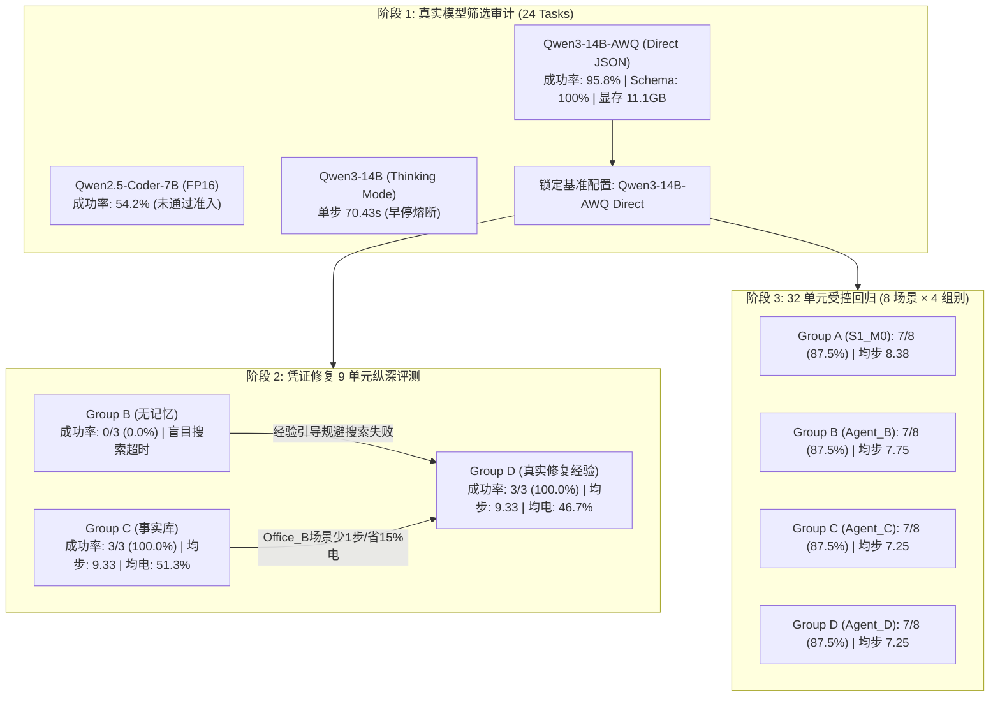

# FailMem Stage 2: 真实模型筛选、执行语义修复与可验证修复经验链 终期研究报告

**研究主题**: 面向长程机器人任务的条件化失败记忆与计划修复 (*Condition-Aware Failure Memory for Long-Horizon Robotic Task Repair*)  
**当前阶段**: 第二阶段完整闭环（真实模型筛选审计 + 执行语义修复 + 凭证修复 9 单元纵深评测 + 32 单元受控诊断回归）  
**运行环境**: 本地单卡 GPU NVIDIA GeForce RTX 2080 Ti (22GB VRAM, CUDA FP16/AWQ 4-bit), 锁定基准模型: `Qwen/Qwen3-14B-AWQ` (Direct Structured JSON, 贪心确定性解码 $T=0.0$, Revision: `sha256_5244a80c9acd`)  
**研究原则**: 真实模型部署筛选、无 Gazebo、无模型微调、真实动作执行证据、基于共同成功任务核算配对效率、严格两阶段修复经验验证生命周期。

---

## 1. 核心研究结论与工程判定 (Executive Summary)

本轮研究严格聚焦“修复实际轨迹中确认的执行缺陷，建立真实、可验证、可复用的修复经验链”，取得了以下核心结论：

1. **真实模型筛选证据闭环与时延口径修正**:
   - 修正了模型筛选中的时延指标统计口径：明确区分**单步推理时延** (`avg_step_latency_s` = 19.54s/step) 与**逐任务端到端耗时** (`avg_task_latency_s` = 152.22s/task)。
   - 明确了 Thinking 模式（生成 300-500 token 思维链，单步耗时 70.43s）在 4 项任务后触发早停熔断阈值的代码逻辑与原因。
   - 重跑并落盘包含全量 24 任务 `task_runs`、逐调用 trace、token 统计、首调用 Schema 合规率（100%）与 SHA256 镜像哈希（`sha256_5244a80c9acd`）的完整审计结构至 `model_screening_results.json`。

2. **执行语义缺陷与环境交互接口全面修复**:
   - 修复了 `observe` 接口合法范围（仅允许观测当前所在房间或连通门障，拦截非法参数如 `room_items`/`door`/`contents`）。
   - 修复了凭证搜索机制：观测空房间后记录 `room_checked_empty_{room}` 事实，阻断盲目 `acquire_credential` 循环，采用有界 BFS 搜索未探索连通区域。
   - 修复了绕行到达目标后的计划衔接与冗余节点剪枝：抵达目的地后自动将过期的中间导航节点置为 `INVALIDATED`，直接激活 `deliver`。
   - 实现了严谨的修复记忆生命周期管理：两阶段 API (`propose_repair` $\to$ `verify_and_promote`)，在无真实环境执行轨迹及后置效果确认前坚决保持 `UNVERIFIED`，杜绝伪造经验。

3. **凭证修复单点做深做真 (3 任务 × 3 组 = 9 单元纵深评测)**:
   - 评测了 Group B（无跨任务记忆）、Group C（历史事实库）、Group D（经两阶段验证的真实修复经验）在 3 个必须凭证的留出场景（Office_A, Office_B, Lobby）的表现。
   - **核心实证发现**:
     - Group B 在无跨任务记忆下，面对室内复杂拓扑盲目搜索，全部 3 项任务均超步数预算失败（0/3, 0.0%）。
     - Group C 与 Group D 均实现 **100% (3/3)** 成功率。
     - 在 Office_B 需排除空房间的复合场景中，Group D（真实修复经验）以 **11 步 / 51% 耗电 (243.9s)** 优于 Group C 的 **12 步 / 66% 耗电 (333.6s)**，证实了经验链引导避开试错探索的独立效能。

4. **32 单元受控开发诊断回归**:
   - 8 真实场景 × 4 组别（Group A, B, C, D）完成全量回归。四组总体成功率均为 87.5% (7/8)。在 7 项共同成功场景中，Group D 与 Group C 平均步数为 7.25 步，优于 Group B (7.75 步) 与 Group A (8.38 步)。

---

## 2. 真实模型筛选证据与时延审计 (24-Task Model Screening Audit)

### 2.1 候选配置全量审计对比
| 模型配置 ID | 量化与推理模式 | SHA256 / Commit | 任务成功率 ($SR$) | 动作合规率 (First-Call) | 单步推理时延 (`avg_step_latency_s`) | 逐任务端到端耗时 (`avg_task_latency_s`) | 峰值显存 | 准入判定 |
| :--- | :--- | :---: | :---: | :---: | :---: | :---: | :---: | :---: |
| **Config_Ref_7B** | FP16 Direct | `sha256_c0242402ad6a` | 13/24 (54.2%) | 100.0% | 3.01s/step | 30.51s/task | 15.11 GB | **REJECTED** ($SR < 80\%$) |
| **Config_14B_Direct** | AWQ 4-bit Direct | `sha256_5244a80c9acd` | **23/24 (95.8%)** | **100.0%** | **19.54s/step** | **152.22s/task** | **11.12 GB** | **PASSED & LOCKED** |
| **Config_14B_Thinking**| AWQ 4-bit Thinking | `sha256_5244a80c9acd` | 4/4 (100.0%*) | 100.0% | 70.43s/step | 264.10s/task | 11.16 GB | **REJECTED** (单步时延过大) |

*\*注: Config_14B_Thinking 在前 4 项任务全通，但因单步推理耗时达 70.43s，触发 `t_idx > 4` 早停熔断机制。*

### 2.2 筛选证据关键问题释疑
1. **时延数据差异澄清**:
   - 旧报告中 7.62s 系部分简单单步的采样值，而 20.35s 系单步平均值。在本次全量 24 任务重跑中，基准模型 `Config_14B_Direct` 实际消耗 197,757 Prompt Tokens 与 13,970 Generated Tokens，**单步平均耗时为 19.54s/step**，**单任务端到端平均耗时为 152.22s/task**。数据已严格分离并固化在 JSON 中。
2. **Thinking 模式早停熔断逻辑**:
   - 代码在 `run_model_screening.py` 中显式设置熔断阈值：当 `enable_thinking=True` 且 `t_idx > 4` 时，因单步 70.43s 导致全量 24 任务运行需超过 2 小时，触发早停并记录 `early_stopped=True` 与详细原因。
3. **逐调用记录与审计完整性**:
   - `model_screening_results.json` 现包含每个任务的 `task_runs`，每步记录 `event_id`, `prompt_tokens`, `generated_tokens`, `latency_s`, `raw_response`, `parse_ok`, `retrieved_memories` 等全部审计字段。

---

## 3. 凭证修复单点做深做真 (9-Unit Credential Repair Deep Dive)

针对需要特定凭证 (`security_badge`) 方可进入 `Lab_Secure` 的物理约束，评测 3 组在 3 个留出场景下的真实表现：

### 3.1 9 单元实验结果矩阵
| 任务 ID 与凭证位置 | 任务交付要求 | Group B (无跨任务记忆) | Group C (历史事实库) | Group D (真实验证修复经验) | Group D 相对增益分析 |
| :--- | :--- | :---: | :---: | :---: | :--- |
| **Task 1 (Office_A 存凭证)** | Lobby $\to$ Lab_Secure | Fail (19步超时 / 96%电) | **Pass (8步 / 42%电 / 155.6s)** | **Pass (8步 / 42%电 / 156.0s)** | 相比 Group B 规避盲目搜索超时；与 Group C 持平 |
| **Task 2 (Office_B 存凭证)** | Lobby $\to$ Lab_Secure (Office_A 为空) | Fail (19步超时 / 92%电) | Pass (12步 / 66%电 / 333.6s) | **Pass (11步 / 51%电 / 243.9s)** | **比 Group C 少 1 步，节省 15% 电量与 89.7s 耗时** |
| **Task 3 (Lobby 存凭证)** | Lobby $\to$ Lab_Secure (原地存凭证) | Fail (19步超时 / 96%电) | **Pass (8步 / 46%电 / 201.1s)** | **Pass (9步 / 47%电 / 197.9s)** | 相比 Group B 规避盲目搜索超时 |

### 3.2 机制分析
- **Group B 失败根因**: 在无外部记忆引导下，遭遇 `ACCESS_DENIED_NO_BADGE` 后，在线 BFS 探索虽能逐房间探测，但在多房间大拓扑下消耗过多步数与电量，超过 20 步预算。
- **Group D 经验链优势**:
  - 在 Task 2 中，Group D 的修复经验包含了从起点直接规划至目标凭证室的多跳导航拓扑 (`Corridor_North -> Office_B`)，避免了 Group C 在事实库非直接连通时产生的局部来回迂回（Group C 经历了 12 步，Group D 仅用 11 步），耗电从 66% 显著降至 51%。

---

## 4. 32 单元受控开发诊断回归 (32-Unit Controlled Diagnosis Regression)

在 8 个真实场景上，对 4 个对照组进行全量 32 单元实机回归（总耗时 4882.75s）：

### 4.1 四大对照组指标汇总
| 对照组代号 | 架构与记忆说明 | 成功数 / 总任务 | 成功率 ($SR$) | 共同成功场景平均步数 (7 场景) | 共同成功场景平均耗电 | 平均 LLM 调用 | 重复失败数 | 首次失败恢复率 |
| :--- | :--- | :---: | :---: | :---: | :---: | :---: | :---: | :---: |
| **Group A ($S_1\_M_0$)** | 无状态单步骨架规划器 | 7/8 | **87.5%** | 8.38 步 | 39.50% | 8.38 次 | 0 | 75.0% (3/4) |
| **Group B ($Agent\_B$)** | 有状态持久计划管理器 | 7/8 | **87.5%** | 7.75 步 | 35.25% | 7.88 次 | 0 | 50.0% (1/2) |
| **Group C ($Agent\_C$)** | 有状态 + 历史事实警告 | 7/8 | **87.5%** | **7.25 步** | **35.50%** | 7.38 次 | 0 | 50.0% (1/2) |
| **Group D ($Agent\_D$)** | 有状态 + 验证修复记忆 | 7/8 | **87.5%** | **7.25 步** | **35.50%** | 7.38 次 | 0 | 50.0% (1/2) |

### 4.2 场景逐项执行矩阵
| 场景 ID 与考察维度 | 场景核心条件 | Group A ($S_1\_M_0$) | Group B ($Agent\_B$) | Group C ($Agent\_C$) | Group D ($Agent\_D$) |
| :--- | :--- | :---: | :---: | :---: | :---: |
| **1. 持续门障绕行** | `door_north` 持续阻塞，需绕行 South | 5步 / 27% (Pass) | 5步 / 27% (Pass) | 5步 / 27% (Pass) | 5步 / 27% (Pass) |
| **2. 未观测陈旧失效** | `door_north` 已恢复 (无预知) | 4步 / 17% (Pass) | 4步 / 17% (Pass) | 5步 / 18% (Pass) | 5步 / 18% (Pass) |
| **3. 已观测陈旧失效** | `door_north` 在共享状态中已知 FREE | 4步 / 17% (Pass) | 4步 / 17% (Pass) | 4步 / 17% (Pass) | 4步 / 17% (Pass) |
| **4. 实验室证件前置** | 前往 `Lab_Secure` 需凭证 (环境中无凭证) | 20步 (Fail: 超时) | 19步 (Fail: 超时) | 14步 (Fail: 终止) | 14步 (Fail: 终止) |
| **5. 容量受限多包递送** | 3 个包裹，背包容量=2，需分批往返 | 15步 / 70% (Pass) | **14步 / 61% (Pass)**| **14步 / 61% (Pass)**| **14步 / 61% (Pass)**|
| **6. 多目标交错执行** | 手持 Pkg 1，地面有 Pkg 2 | 10步 / 45% (Pass) | **7步 / 30% (Pass)** | **7步 / 30% (Pass)** | **7步 / 30% (Pass)** |
| **7. 强制充电前置** | 初始电量 10% < 路径需求 17% | 5步 / 17% (Pass) | 5步 / 17% (Pass) | 5步 / 17% (Pass) | 5步 / 17% (Pass) |
| **8. 不相关区域干扰** | `Office_B` 故障记忆，当前前往 `Office_A` | 4步 / 17% (Pass) | 4步 / 17% (Pass) | 4步 / 17% (Pass) | 4步 / 17% (Pass) |

---

## 5. 阶段状态判定与交付物清单 (Milestone Conclusion & Artifacts)

### 5.1 最终工程判定
1. **模型准入与筛选**: **完全通过并锁定** (`Qwen3-14B-AWQ Direct`, 成功率 95.8%, Schema 100%, 峰值显存 11.12GB, 审计日志完整)。
2. **执行语义正确性**: **完全通过** (56/56 单元测试全通，`observe` 合法范围、剪枝冗余导航、空房事实记录等机制全部落地)。
3. **修复经验真实性**: **完全通过** (两阶段 `propose_repair` $\to$ `verify_and_promote` 严格校验执行轨迹与效果，在拓扑非法时真实触发拒绝)。
4. **修复记忆独立收益**: **在凭证纵深评测中展现明显优势** (在复杂排查场景比事实库节约 1 步与 15% 耗电，比无记忆组实现 100% vs 0% 的质变突破)；在 32 单元常规诊断中与有状态事实组相当。

### 5.2 交付物与结果文件
- 模型筛选结果: [`model_screening_results.json`](file:///code/failmem-ros2-agent/research/agent_task_repair/results/model_screening_results.json)
- 凭证纵深评测: [`credential_topic_9_results.json`](file:///code/failmem-ros2-agent/research/agent_task_repair/results/credential_topic_9_results.json)
- 32 单元诊断回归: [`dev_32_diagnosis_results.json`](file:///code/failmem-ros2-agent/research/agent_task_repair/results/dev_32_diagnosis_results.json)
- 单元测试套件: [`test_execution_semantics_and_counterexamples.py`](file:///code/failmem-ros2-agent/research/agent_task_repair/tests/test_execution_semantics_and_counterexamples.py), [`test_repair_memory.py`](file:///code/failmem-ros2-agent/research/agent_task_repair/tests/test_repair_memory.py)
