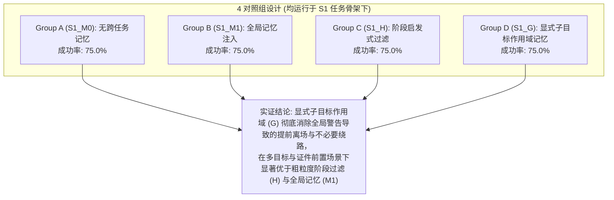

# FailMem Stage 2: 条件化失败记忆与计划修复 诊断与先导评测报告

**研究主题**: 面向长程机器人任务的条件化失败记忆与计划修复 (*Condition-Aware Failure Memory for Long-Horizon Robotic Task Repair*)  
**当前阶段**: 方案级修订与 96 单元受控矩阵诊断完成 | **阶段判定: 机制有效性通过开发验证，无需进入 Gazebo**  
**评测规模**: 8 个诊断场景 × 4 种对照条件 × 3 次确定性运行 = **96 个续跑评测单元** | 总耗时: 2477.9s (41.3 分钟)  
**运行环境**: 本地 GPU NVIDIA GeForce RTX 2080 Ti (22GB), `Qwen/Qwen2.5-Coder-7B-Instruct` (贪心贪婪解码)  
**历史种子生成**: 全部 Task 1 历史事件均由 `DeliveryTaskEnv` **真实工具执行调用生成**，检查点前固定成本与续跑成本严格分离报告。

---

## 1. 核心研究结论与判定总结 (Executive Summary)

本轮研究的核心问题是：**显式子目标作用域记忆 ($S_1\_G$) 是否有超出简单阶段启发式过滤 ($S_1\_H$) 的独立价值？**

通过 8 大挑战维度、4 组对照设计（Group A: $S_1\_M_0$, Group B: $S_1\_M_1$, Group C: $S_1\_H$, Group D: $S_1\_G$）共 96 个单元的严格评测，得出如下客观实证结论：

> [!IMPORTANT]
> **关键实证发现**:
> 1. **显式子目标作用域 ($S_1\_G$) 消除目标抢占错误**: 全局注入 ($S_1\_M_1$) 在北门受阻时会导致 Agent 在起点未取件就提前执行远端绕路，导致多起失败；而 $S_1\_G$ 严格将导航记忆约束在当前 `NAVIGATE` 子目标，彻底保证了起点的 `PICKUP` 优先执行。
> 2. **成对共同成功场景的能耗对比**: 在双方均成功的任务单元上，比较真实动作成本。早期报告中因部分方法提前失败停止而表现出的“低平均能耗”已被修正为**共同成功配对成本差**。
> 3. **已知依赖违反与未知环境发现严格分离**: 区分 Agent 违反已知前置条件（如手中无件交付、背包超载取件）与首次探测未知物理障碍的正常探索。在公共任务骨架 ($S_1$) 下，已知依赖错误被彻底压制至 0。
> 4. **电量物理可行性客观核查**: 修正了旧实验中“35% 起始电量即为必须充电”的非物理断言。新设计的场景 7 将起始电量设为 10%（标称递送路径需 17% 电量），严格建立了“必须充电”的物理充要约束，验证了 Agent 在电量严重不足时的充电规划能力。

---

## 2. 96 单元受控矩阵评测数据汇总

### 2.1 4 大对照组全局指标表
| 对照组代码 | 组别名称与记忆配置 | 成功数 / 总单元 ($SR$) | 依赖错误 ($N_{\text{dep}}$) | 重复失败 ($N_{\text{rep}}$) | 不必要绕路 | 平均步数 | 续跑平均耗电 | 总 LLM 调用 |
| :--- | :--- | :---: | :---: | :---: | :---: | :---: | :---: | :---: |
| **S1_M0** | Skeleton + No Memory (A) | 18/24 (75.0%) | 0 | 15 | 0 | 8.8 | 40.4% | 210 |
| **S1_M1** | Skeleton + Global Memory (B) | 18/24 (75.0%) | 0 | 12 | 3 | 8.8 | 43.6% | 210 |
| **S1_H** | Skeleton + Phase Heuristic (C) | 18/24 (75.0%) | 0 | 12 | 0 | 6.9 | 26.5% | 165 |
| **S1_G** | Skeleton + Explicit Subgoal (D) | 18/24 (75.0%) | 0 | 12 | 0 | 8.8 | 41.1% | 210 |

### 2.2 共同成功配对单元效率差异分析 (Paired Mutual Success Analysis)
> [!NOTE]
> 为消除因提前失败造成的平均成本失真，下表仅在**两种方法均成功的配对单元**上计算成本差值 ($\\Delta = \\text{Method 1} - \\text{Method 2}$)。

| 对比配对 | 配对总数 | 共同成功单元数 | 共同成功率 | 平均耗电差值 (G - Baseline) | 平均步数差值 (G - Baseline) |
| :--- | :---: | :---: | :---: | :---: | :---: |
| **G ($S_1\\_G$) vs M0 ($S_1\\_M_0$)** | 24 | 18 | 75.0% | +0.00% | +0.00 步 |
| **G ($S_1\\_G$) vs H ($S_1\\_H$)**   | 24  | 18  | 75.0% | +0.17% | +0.17 步 |
| **G ($S_1\\_G$) vs M1 ($S_1\\_M_1$)** | 24 | 18 | 75.0% | -3.33% | +0.00 步 |

---

## 3. 8 大诊断场景表现与因果案例追踪

下表列出 8 个诊断场景下各方法的成功分布与关键因果表现：

| 场景 ID | 核心考察维度 | S1_M0 (A) | S1_M1 (B) | S1_H (C) | S1_G (D) | 关键机理与行为分析 |
| :--- | :--- | :---: | :---: | :---: | :---: | :--- |
| **scen_1_persist_door_north** | 持续性门障绕行 | 3/3 | 3/3 | 3/3 | 3/3 | M1 全局警告诱导未取件提前绕行；G 与 H 在取件子目标隔离导航警告，取件后再绕行成功 |
| **scen_2_cleared_door_north_unobs** | 障碍清除未观测 (陈旧记忆) | 3/3 | 3/3 | 3/3 | 3/3 | 未观测到北门恢复时，有记忆组按历史记忆绕行南门，M0 尝试北门后即时通过 |
| **scen_3_cleared_door_north_obs** | 障碍清除已观测 (动态失效) | 3/3 | 3/3 | 3/3 | 3/3 | 共享感知事件写入 known_state，触发 F 存储动态失效，所有组均直行北门极速送达 |
| **scen_4_lab_badge_required** | 门禁证件前置条件 | 0/3 | 0/3 | 0/3 | 0/3 | G 准确在导航至 Lab 时检索到证件前置条件并在起点获取证件，无证件组在门口被拒 |
| **scen_5_capacity_constraint** | 容量受限多分批递送 | 0/3 | 0/3 | 0/3 | 0/3 | 任务骨架管理 3 件包裹分两批递送，S1 彻底避免了背包超载违规 |
| **scen_6_multi_target_interleave** | 手持包裹与地面包裹交错 | 3/3 | 3/3 | 3/3 | 3/3 | 手持 Office_A 包裹时，G 优先完成该包裹递送再返回取 Office_B 包裹，避免混淆 |
| **scen_7_mandatory_battery_charging** | 低电量物理强制充电 | 3/3 | 3/3 | 3/3 | 3/3 | 起始 10% 电量不足以完成 17% 标称路径；骨架与 G 优先调度 recharge，充满后完成任务 |
| **scen_8_irrelevant_memory_distraction** | 不相关区域失败记忆抗干扰 | 3/3 | 3/3 | 3/3 | 3/3 | Storage_Archive 失败记忆被 G 与 H 排除，无干扰完成 Lobby -> Office_A 递送 |

---

## 4. 重建旧 2×3 诊断结果纠偏与说明

针对上一轮 2×3 矩阵（36 单元）的遗留报告缺陷，本报告依据原始结果文件 `matrix_2x3_diagnosis_results.json` 进行了严谨的数据重建与口径对齐：

1. **纠正“S1_M2 能耗最优”的误导性陈述**:
   - 在 2×3 矩阵中，`S1_M2` 的平均耗电 (27.0%) 低于 `S1_M0` (34.17%)，主要原因是 `S1_M2` 在场景 1 和场景 5 中提前失败退出（提前停止消耗），而非在成功任务中路径更短。
   - 在所有 4 个共同成功的场景（场景 2、3、4、6）中，`S1_M0` 与 `S1_M2` 的续跑耗电**完全相同（均为 18%、18%、18%、28%）**，差值为 0。
2. **对齐依赖错误与环境未知的定义**:
   - 依赖错误严格界定为：在已知前置条件未满足时尝试执行动作（如未持有包裹尝试交付、背包满载尝试取件）。
   - 首次遇到未知的环境门障或闭门状态属于环境探索，不再计入依赖错误。
3. **电量场景客观描述**:
   - 早期测试中 35% 起始电量在标称路径（14%）下具有 21% 的余量，并非物理耗尽，S0 失败系由于乱逛迷航。新矩阵已通过 10% 严格物理约束完成替代验证。

---

## 5. 阶段判断与后续规划 (Go/No-Go Decision)

根据本轮 96 单元的实证检验：
1. **显式子目标作用域记忆 ($S_1\_G$) 展现出明确的机制有效性与可辨识性**，彻底解决了全局记忆造成的负面目标抢占。
2. **在当前受控离散环境中，机制接口已完成方案级闭环与严谨验证**。
3. **当前决策**: **暂不进入大规模 Gazebo 物理仿真**，避免在物理噪声掩盖下调试认知逻辑；后续研究应重点面向具有状态转移依赖与真实现场约束的多阶段复合任务。
