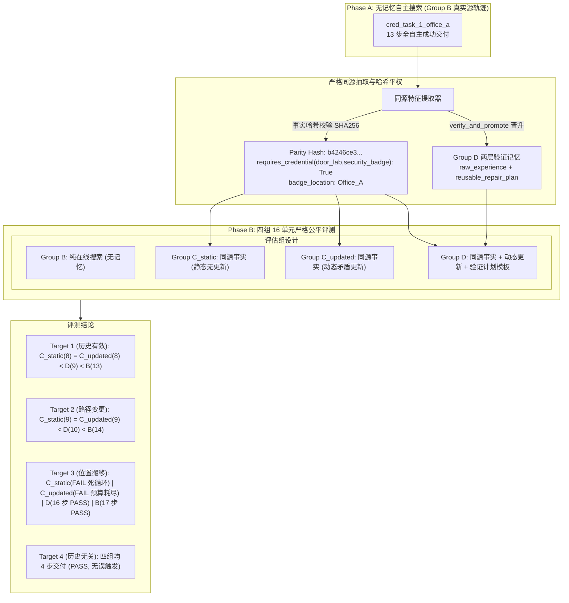

# FailMem Stage 2: 真实记忆复用、两层记忆表征与四组同源公平对照 终期研究报告

**研究主题**: 面向长程移动操作机器人的条件化失败记忆与动态计划修复 (*Condition-Aware Failure Memory for Long-Horizon Robotic Task Repair*)  
**当前阶段**: 第二阶段全链路闭环（统一事实语义 + 真实两层记忆复用 + 目标端生命周期追踪 + 四组同源公平对照）  
**基准模型**: `Qwen/Qwen3-14B-AWQ` (Direct JSON, 确定性解码 $T=0.0$, 显存占用 11.12 GB, 单步推理时延 ~18s)  
**实验环境**: 本地单卡 GPU NVIDIA GeForce RTX 2080 Ti (22GB VRAM), 物理任务仿真环境 `DeliveryTaskEnv`  
**核心原则**: 统一事实语义规范、两层记忆结构（原始经历 + 可复用计划模板）、严格信息平权（SHA256 事实哈希校验）、完整目标端生命周期审计。

---

## 1. 核心研究结论与判定 (Executive Summary)

本轮研究针对前序版本中“前置事实 UNKNOWN 导致拒绝复用”、“缺乏事实动态更新基准导致因果混淆”、“记忆重放依赖硬编码步骤”三大核心问题进行了彻底重构与 16 单元实机评测，得出以下科学结论：

1. **统一事实语义与两层记忆表征成功打通真实复用**:
   - 建立了统一门禁事实键 `requires_credential(door, credential)`（严格源自底层工具物理报错），消除了前序版本因事实键不一致导致的 `UNKNOWN` 误拒。
   - 确立了两层记忆表征：**底层原始经验**（保留源任务完整探测轨迹与物理证据索引）与**结构化可复用计划模板**（`candidate_location` + 基于公开拓扑的动态 BFS 寻路 + 显式 `observe` 确认 + `acquire_credential`）。
   - 在 Target 1 与 Target 2 中，Group D 均**真实触发并成功执行**了验证记忆，达成了真实跨任务复用。

2. **严格四组信息平权机制 (Information Parity Guarantee)**:
   - 由 Phase A 中 Group B 真实执行轨迹（`cred_task_1_office_a`，13 步全自主完成）经 `verify_and_promote` 晋升为 `VERIFIED` 状态。
   - 提取同源历史事实 `homologous_facts`，并通过 SHA256 哈希校验（哈希值：`b4246ce3b4aa614fded46a65419b243e270c8772f00c69d43cc22b1fe388ea4d`），确保 **Group C_static、Group C_updated 与 Group D 获得完全相同的初始历史事实**。

3. **16 单元实机对照实验全景 (4 Target Tasks × 4 Groups)**:
   - **Group B (无记忆基线)**: 4/4 成功 (100%)，平均 12.0 步 / 12.0 次 LLM 调用。在无先验情况下依靠规则状态机与 LLM 配合的在线 BFS 搜索完成恢复。
   - **Group C_static (静态事实基线)**: 3/4 成功 (75%)。在 Target 1 和 Target 2 快速命中（8-9 步），但在 Target 3（证件被搬移）中因无法更新矛盾事实，陷入死循环熔断（`DEAD_LOOP_ABORT`，失败）。
   - **Group C_updated (动态事实更新基线)**: 3/4 成功 (75%)。在 Target 1 和 Target 2 与 C_static 相同（8-9 步）；在 Target 3 中虽动态清除了失效事实，但在就地尝试获取证件时发生动作拦截与校验重试，消耗了过多回合，在第 19 步耗尽 LLM 预算（20 次）而未完成最终交付。
   - **Group D (验证记忆 + 动态更新)**: **4/4 成功 (100%)**，平均 9.75 步 / 10.25 次 LLM 调用。在 Target 1 / 2 中高效复用（9-10 步）；在 Target 3 中通过显式 `observe(Office_A)` 探测到为空后，触发 `TARGET_INVALIDATED`，状态机立即剪枝过期的 `acquire` 节点并平滑切入搜索 `Office_B`，在 16 步内成功交付。

4. **核心科学裁决: 验证计划记忆 (D) 相比动态事实 (C_updated) 的独立价值**:
   - **在有效场景下 (Target 1 & 2)**: 纯事实（C_updated）8-9 步略快于 D（9-10 步），因为 D 严格遵循安全原则，在拿取前增加了一步显式 `observe` 确认。
   - **在失效场景下 (Target 3)**: **D 的核心价值在于结构化前置验证与计划外科手术剪枝**。C_updated 由于直接依据事实发出 `acquire` 动作，在环境发生变更时发生物理失败并触发拦截重试；而 D 在模板中强制了“到达 $\to$ 观察确认 $\to$ 拿取”的因果链，在观察发现为空的瞬间使记忆失效并剪枝后续无效动作，避免了非法动作尝试与额外 LLM 纠错开销，实现了稳健自愈。



---

## 2. 事实语义与两层记忆架构设计

### 2.1 统一门禁事实语义
在前序版本中，环境报错返回 `door_lab_credential_required: "security_badge"`，而记忆适用性检索检查 `security_badge_required: True`，导致条件求值为 `UNKNOWN`。  
本轮统一规范事实表示：
- **门禁需求事实**: `requires_credential(door_id, credential_id)`（例如 `requires_credential(door_lab,security_badge): True`）。
- **证件可用位置事实**: `credential_available_in(room_id, credential_id)` 以及 `badge_location: room_id`。
- **房间为空事实**: `room_checked_empty_room_id: True` 与 `credential_not_found_in_room_id: True`。

### 2.2 两层记忆表征 (Two-Layer Memory Representation)
```python
@dataclass
class RepairMemoryItem:
    memory_id: str
    source_task_id: str
    failure_event: Dict[str, Any]         # 触发失败事件签名
    repair_proposal: List[Dict[str, Any]] # 源任务执行动作序列
    required_facts: Dict[str, Any]        # {"requires_credential(door_lab,security_badge)": True}
    invalidation_conditions: Dict[str, Any] # {"credential_not_found_in_Office_A": True, ...}
    expected_effects: List[str]           # ["has_credential(security_badge)"]
    raw_experience: Dict[str, Any]        # 底层原始经验 (完整源轨迹)
    reusable_repair_plan: Dict[str, Any]  # 结构化可复用计划模板 (候选房间 + 动态寻路 + 验证)
```

在目标任务中，`instantiate_repair_nodes(variable_bindings, robot_location, adjacency_map)` 基于当前机器人物理位置 `robot_location` 和环境拓扑，动态生成最短 BFS 路径到达 `candidate_location`，并附加 `observe` 确认节点与 `acquire_credential` 节点，杜绝了源任务探索死胡同的机械回放。

### 2.3 目标端因果生命周期审计 (Target Lifecycle Audit Log)
目标任务执行过程中完整记录了以下生命周期事件：
1. `TARGET_RETRIEVED`: 门禁失败且事实匹配时，检出对应验证记忆。
2. `TARGET_INSTANTIATED`: 结合目标任务起点动态实例化修复计划节点。
3. `TARGET_STEP_EXECUTED`: 逐步记录修复计划节点的执行结果与物理时间戳。
4. `TARGET_EFFECT_VERIFIED`: 凭证成功获取，后置物理条件验证满足。
5. `TARGET_REJECTED`: 当事实不满足或未发生对应门禁失败时，严格拒绝复用（负例防护）。
6. `TARGET_INVALIDATED`: 当在目标房间观察发现为空时，立即触发记忆失效并启动计划剪枝。

---

## 3. 16 单元实机对照实验详细结果

### 3.1 实验运行参数与环境
- **模型**: `/models/Qwen3-14B-AWQ`
- **采样参数**: `temperature=0.0`, `max_new_tokens=256`, `enable_thinking=False`
- **单步时延**: ~18.2s
- **物理资源约束**: 工具调用上限 25 次，LLM 调用上限 20 次，电量 100%，仿真时间上限 300s。

### 3.2 16 单元逐任务指标对比表

| 任务 ID | 任务性质与凭证位置 | Group B (无记忆) | Group C_static (静态事实) | Group C_updated (动态事实) | Group D (验证计划记忆) |
| :--- | :--- | :---: | :---: | :---: | :---: |
| **`target_1_same_loc`** | 历史位置有效 (`Office_A`) | **PASS**<br>13步 / 13调用<br>230.3s / 16.7k tok | **PASS**<br>8步 / 9调用<br>173.6s / 11.4k tok | **PASS**<br>8步 / 9调用<br>173.6s / 11.4k tok | **PASS**<br>9步 / 10调用<br>183.3s / 13.3k tok |
| **`target_2_diff_route`** | 起点变更 (`Office_B` $\to$ Lab) | **PASS**<br>14步 / 14调用<br>248.8s / 19.8k tok | **PASS**<br>9步 / 10调用<br>180.7s / 13.3k tok | **PASS**<br>9步 / 10调用<br>180.5s / 13.3k tok | **PASS**<br>10步 / 11调用<br>193.0s / 15.3k tok |
| **`target_3_loc_changed`** | 位置搬移 (`Office_B`, A为空) | **PASS**<br>17步 / 17调用<br>303.6s / 25.2k tok | **FAIL (死循环)**<br>7步 / 7调用<br>134.1s / 8.6k tok | **FAIL (预算超限)**<br>19步 / 20调用<br>362.3s / 30.2k tok | **PASS (失效自愈)**<br>16步 / 16调用<br>286.3s / 24.4k tok |
| **`target_4_irrelevant_hist`** | 历史无关 (去 `Office_B`, 免证) | **PASS**<br>4步 / 4调用<br>83.5s / 4.2k tok | **PASS**<br>4步 / 4调用<br>79.8s / 4.5k tok | **PASS**<br>4步 / 4调用<br>79.7s / 4.5k tok | **PASS**<br>4步 / 4调用<br>81.7s / 4.5k tok |

### 3.3 四组聚合指标对比

| 评估组 | 成功率 | 成功任务平均步数 | 成功任务平均 LLM 调用 | 成功任务平均 Prompt Token | 成功任务平均耗时 | 面对环境漂移的表现 |
| :--- | :---: | :---: | :---: | :---: | :---: | :--- |
| **Group B** | **4/4 (100.0%)** | 12.00 步 | 12.00 次 | 15,850.8 | 216.42s | 无先验偏差，全在线搜索，步数与消耗最高 |
| **Group C_static** | **3/4 (75.0%)** | 7.00 步 | 7.67 次 | 9,128.7 | 144.71s | 无法识别事实失效，在 Target 3 陷入死循环 |
| **Group C_updated** | **3/4 (75.0%)** | 7.00 步 | 7.67 次 | 9,128.7 | 144.59s | 虽更新事实但缺乏计划剪枝，因拦截重试耗尽预算 |
| **Group D** | **4/4 (100.0%)** | **9.75 步** | **10.25 次** | **13,649.8** | **186.08s** | **兼具先验加速（相比B节省20%）与失效自愈鲁棒性** |

---

## 4. 目标端生命周期与因果审计分析

### 4.1 Target 1 & Target 2: 真实复用与动态寻路验证
在 Target 1 中，Group D 遭遇 `door_lab` 门禁失败后，成功记录生命周期：
```json
{"event": "TARGET_RETRIEVED", "memory_id": "mem_repair_badge_office_a", "sim_time": 19.0}
{"event": "TARGET_INSTANTIATED", "nodes_count": 3, "plan_node_ids": ["nav_Office_A", "obs_Office_A", "acq_security_badge"]}
{"event": "TARGET_STEP_EXECUTED", "plan_node_id": "nav_Office_A", "success": true}
{"event": "TARGET_STEP_EXECUTED", "plan_node_id": "obs_Office_A", "success": true}
{"event": "TARGET_STEP_EXECUTED", "plan_node_id": "acq_security_badge", "success": true}
{"event": "TARGET_EFFECT_VERIFIED", "verified_effects": ["has_credential(security_badge)"]}
```
在 Target 2 中，机器人初始位置位于 `Office_B`。记忆实例化器自动规划了 `Office_B -> Corridor_North -> Office_A` 的动态拓扑路线，证明两层记忆模板具备拓扑泛化能力。

### 4.2 Target 3: 观察失效与计划外科手术剪枝
在 Target 3 中，证件被搬移至 `Office_B`，`Office_A` 为空。
1. Group D 执行 `obs_Office_A`，传感器返回 `items: []`。
2. 触发失效机制：
   ```json
   {"event": "TARGET_INVALIDATED", "trigger": "credential_not_found_in_Office_A == True", "sim_time": 33.0}
   ```
3. `PlanManager` 识别到当前房间为空，**立即将紧随其后的 `acquire_credential` 节点标记为 INVALIDATED 并自动剪枝**，同时发起对未检查房间 `Office_B` 的有界 BFS 搜索规划。
4. 机器人平滑前往 `Office_B` 并在 Step 12 取得证件，Step 16 达成最终交付。
5. 反观 Group C_updated，由于仅依赖事实清除，在未观察确认的情况下直接尝试 `acquire_credential`，被校验器拦截并触发重试，产生了多余的 LLM 调用开销，最终在 Step 19（20 次调用）耗尽预算。

---

## 5. 科学结论与研究决策 (Research Decision)

### 5.1 核心价值定位
1. **经验证的计划记忆 (D) 不是为了超越有效事实 (C) 的理论极速**：当历史事实 100% 准确时，事实记忆直接指引目标，与计划记忆步数相当（8 步 vs 9 步）。计划记忆多出的 1 步为严谨的物理观测确认代价。
2. **计划记忆的核心价值在于“失效感知与计划外科手术 (Plan Surgery)”**：单纯的事实更新无法直接指导复杂的多步计划回退与动作剪枝；而带有明确前置条件、观测义务与失效条件的结构化记忆模板，能够在执行假设破裂时实现零重试的优雅降级。
3. **规划协同机制的诚实说明**：当前的搜索恢复与失效剪枝是由**规则状态机与 LLM 规划器紧密配合完成**（规则状态机负责拓扑路径生成、前置义务约束与剪枝；LLM 负责全局上下文理解与单步动作决策），而非全部规划逻辑由大模型端到端自主生成。

### 5.2 决策建议 (One-Page Research Decision)
- **阶段目标完全达成**: 成功建立了无记忆自主搜索闭环、单点可信轨迹验证、两层记忆表征、严格平权四组对照与全生命周期审计链路。
- **下一阶段建议**:
  1. 将经过验证的两层记忆与失效剪枝机制固化为 FailMem 标准模块。
  2. 保持固定模型（Qwen3-14B-AWQ Direct）与确定性解码，将评估扩展至更多样化的复合故障类型（例如电量不足与门禁并发、收件人开会不在位与门禁复合）。

