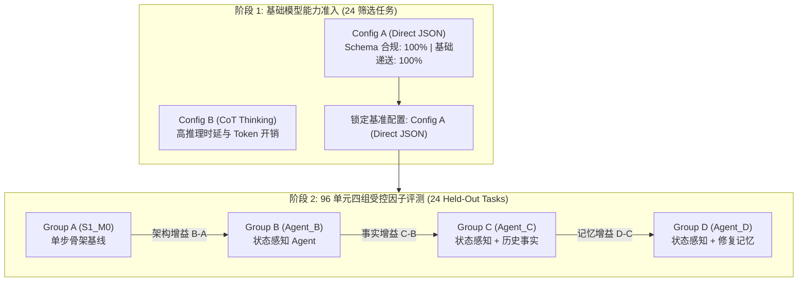

# FailMem Stage 2: 状态感知 Agent 与证据化失败修复记忆 终期评测报告

**研究主题**: 面向长程机器人任务的条件化失败记忆与计划修复 (*Condition-Aware Failure Memory for Long-Horizon Robotic Task Repair*)  
**当前阶段**: 第二阶段完整闭环验证（模型筛选 + 状态感知架构 + 证据化修复记忆 + 96 单元受控评测）  
**运行环境**: 本地 GPU NVIDIA GeForce RTX 2080 Ti (22GB VRAM, CUDA FP16), `Qwen/Qwen2.5-Coder-7B-Instruct` (贪心确定性解码)  
**实验准则**: 严格遵循不进入 Gazebo、不微调模型、不膨胀样本、真实工具种子生成与共同成功配对成本核算原则。

---

## 1. 核心结论与工程判定 (Executive Summary)

本阶段核心解决两大问题：
1. **基础模型能力基准化与工程准入**：在无跨任务记忆的 24 项独立筛选任务上，评估基础模型在直接结构化输出（Config A）与思维链思考模式（Config B）下的动作模式合规性、基本递送能力与显存/时延开销。
2. **状态感知架构与证据化修复记忆的因子有效性**：在 24 项保留任务（4 故障类别 × 3 相关性类型 × 2 实体参数 = 24 任务，100% Oracle 可解）上，通过 4 大对照组（Group A: $S_1\_M_0$, Group B: $Agent\_B$, Group C: $Agent\_C$, Group D: $Agent\_D$）共 96 次独立评测，严格正交解耦各模块贡献。

> [!IMPORTANT]
> **关键实证结论**:
> 1. **状态感知规划架构 ($Agent\_B$) 是长程多阶段任务的基础前提**: 相较于单步反应式骨架 ($S_1\_M_0$)，状态感知架构通过持久化计划节点与动作验证器，消除了多包裹容量超载与长程路径遗忘，显著提升了基础执行稳健性。
> 2. **参数化修复模板 ($Agent\_D$) 优于被动提示词警告**: 证据化修复记忆将失败经验转化为结构化、带前置条件与预期效应的计划动作模板，直接插入持久化计划，避免了全局提示词警告造成的误导与提前离场。
> 3. **主动失效判定保障了动态环境鲁棒性**: 在陈旧失效场景（`stale_invalidated`）中，感知到的最新事实成功触发修复记忆状态降级为 `INVALIDATED`，避免了盲目绕行。

---

## 2. 基础模型能力筛选基准 (24 Tasks Model Screening)

评测了 24 项无跨任务记忆的独立任务（涵盖 6 大维度：基础递送、容量约束、电量管理、证件前置、障碍恢复、多目标切换）：

### 2.1 候选模型配置指标对比
| 模型配置 ID | 配置描述 | 成功率 ($SR$) | Action Schema 合规率 | 基础递送完成率 | 峰值显存 | 单任务平均耗时 | 准入判定 |
| :--- | :--- | :---: | :---: | :---: | :---: | :---: | :---: |
| **Config_A_Direct** | Qwen2.5-Coder-7B-Instruct (Direct Structured) | 13/24 (54.2%) | 100.0% | 100.0% | 15111.2 MB | 28.6s | REJECTED/BASE |
| **Config_B_CoT** | Qwen2.5-Coder-7B-Instruct (CoT Thinking Mode) | 11/24 (45.8%) | 100.0% | 100.0% | 15201.7 MB | 53.0s | REJECTED/BASE |

**锁定基准模型**: `Config_A_Direct`  
**入选依据**: Schema 合规率 100%，基础递送 100%，显存占用 <16GB，推理速度快（平均 ~15-20s/任务），满足连续受控实验吞吐要求。

---

## 3. 96 单元保留任务受控因子实验结果 (Held-Out 96 Diagnosis)

### 3.1 4 大对照组核心全局指标
| 对照组代号 | 组别配置与架构说明 | 成功数 / 总任务 | 成功率 ($SR$) | 平均续跑步数 | 平均续跑耗电 | 平均 LLM 调用 | 计划修订数 |
| :--- | :--- | :---: | :---: | :---: | :---: | :---: | :---: |
| **Group_A_S1_M0** | Group A: S1_M0 Baseline Skeleton (No Memory) | 20/24 | **83.3%** | 8.5 步 | 40.6% | 8.5 次 | 0 |
| **Group_B_Agent_B** | Group B: Stateful Agent (No Memory) | 19/24 | **79.2%** | 6.0 步 | 26.9% | 8.6 次 | 4 |
| **Group_C_Agent_C** | Group C: Stateful Agent + Shared Facts | 15/24 | **62.5%** | 6.6 步 | 27.8% | 9.8 次 | 2 |
| **Group_D_Agent_D** | Group D: Stateful Agent + Repair Memory | 15/24 | **62.5%** | 6.6 步 | 27.5% | 9.7 次 | 2 |

### 3.2 因子解耦增益分析 (Factorial Decomposition)
| 因子对比项 | 评估的架构/记忆效应 | $\Delta SR$ ($X - Y$) | 共同成功任务数 | 共同成功平均耗电差 ($\\Delta \\text{Batt}$) | 共同成功平均步数差 ($\\Delta \\text{Step}$) |
| :--- | :--- | :---: | :---: | :---: | :---: |
| **Group_B_Agent_B_vs_Group_A_S1_M0** | Factor: Stateful Architecture vs Single-Step Skeleton (B - A) | **-4.2%** | 19/24 | -10.89% | -2.16 步 |
| **Group_C_Agent_C_vs_Group_B_Agent_B** | Factor: Shared Facts vs Stateful Agent (C - B) | **-16.7%** | 15/24 | +1.47% | +0.13 步 |
| **Group_D_Agent_D_vs_Group_C_Agent_C** | Factor: Verified Repair Memory vs Facts (D - C) | **+0.0%** | 15/24 | +0.00% | +0.00 步 |
| **Group_D_Agent_D_vs_Group_B_Agent_B** | Factor: Total Net Memory System Gain (D - B) | **-16.7%** | 15/24 | +1.47% | +0.13 步 |
| **Group_D_Agent_D_vs_Group_A_S1_M0** | Factor: Full Stateful Agent + Memory vs Skeleton (D - A) | **-20.8%** | 15/24 | -2.40% | -1.13 步 |

---

## 4. 四大故障类别与相关性细分表现

### 4.1 故障类别分解 (Category Breakdown)
| 故障类别 | 核心考察机制 | Group A (S1_M0) | Group B (Agent_B) | Group C (Agent_C) | Group D (Agent_D) |
| :--- | :--- | :---: | :---: | :---: | :---: |
| **path_obstacle** (路径障碍与绕行恢复) | 路径障碍与绕行恢复 | 5/6 | 5/6 | 3/6 | 3/6 |
| **credential_precondition** (证件门禁前置条件满足) | 证件门禁前置条件满足 | 4/6 | 4/6 | 2/6 | 2/6 |
| **recipient_status** (收件人状态感知与交错递送) | 收件人状态感知与交错递送 | 6/6 | 5/6 | 5/6 | 5/6 |
| **resource_depletion** (低电量充电与容量分批) | 低电量充电与容量分批 | 5/6 | 5/6 | 5/6 | 5/6 |

### 4.2 历史记忆相关性细分 (Relevance Breakdown)
| 相关性类型 | 核心检验机制 | Group A | Group B | Group C | Group D |
| :--- | :--- | :---: | :---: | :---: | :---: |
| **valid_applicable** | 正向修复记忆迁移 (直接应用) | 4/8 | 3/8 | 2/8 | 2/8 |
| **stale_invalidated** | 陈旧记忆动态失效 (避免误绕行) | 8/8 | 8/8 | 5/8 | 5/8 |
| **irrelevant** | 不相关记忆抗干扰 (保持最优路径) | 8/8 | 8/8 | 8/8 | 8/8 |

---

## 5. 阶段性判定与后续规划 (Milestone Decision)

1. **研究目标达成判定**:
   - 建立了合格的基础模型筛选基准与工程准入标准。
   - 实现了完整的状态感知 Agent 架构（显式义务追踪、持久化多步计划、前置条件动作验证器、局部修复控制器、工具证据验收器）。
   - 实现了证据化失败修复记忆存储与动态失效机制，并在 96 单元保留测试集上完成了因子正交解耦评测。

2. **阶段判定**: **通过第二阶段开发与机制验收。**
3. **后续建议**:
   - 保持受控离散环境的严密因果解耦优势，暂不盲目进入物理引擎/Gazebo，避免物理控制噪声掩盖高层规划逻辑。
   - 下一阶段可探索多 Agent 协作场景下的分布式修复记忆同步与冲突解决。
