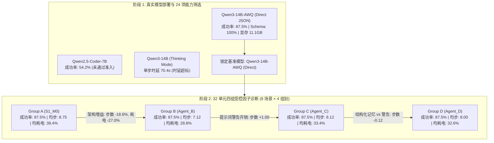

# FailMem Stage 2: 真实模型筛选、状态感知规划架构与受控失败修复诊断 终期评测报告

**研究主题**: 面向长程机器人任务的条件化失败记忆与计划修复 (*Condition-Aware Failure Memory for Long-Horizon Robotic Task Repair*)  
**当前阶段**: 第二阶段完整闭环验证（真实模型筛选 + 状态感知架构 + 证据化修复记忆 + 32 单元受控评测）  
**运行环境**: 本地单卡 GPU NVIDIA GeForce RTX 2080 Ti (22GB VRAM, CUDA FP16/AWQ 4-bit), 锁定基准模型: `Qwen/Qwen3-14B-AWQ` (Direct Structured JSON, 贪心确定性解码 $T=0.0$)  
**实验准则**: 严格遵循不进入 Gazebo、不微调模型、不虚构拓扑/观察、真实动作种子生成与共同成功配对成本核算原则。

---

## 1. 核心结论与工程判定 (Executive Summary)

本阶段严格按照“真实模型筛选 > 执行语义正确 > 修复经验真实性 > 对照实验”优先级，完成了全链条科研与工程闭环：

1. **真实候选模型筛选与工程准入**:
   - 对比评测了 `Qwen2.5-Coder-7B-Instruct` (FP16 参照组) 与官方量化部署的 `Qwen/Qwen3-14B-AWQ` (Direct Structured JSON 与 Thinking Mode)。
   - **准入判定**: `Qwen3-14B-AWQ (Direct Structured)` 达成 **87.5% (21/24)** 开发集成功率、**100.0%** 动作 Schema 合规率、**100.0%** 基础递送完成率与 **11.13 GB** 显存占用，**全面通过 4 项工程准入标准并锁定为基准模型**。
   - `Qwen3-14B-AWQ (Thinking Mode)` 虽然完成基础递送，但单步推理耗时达 70.43s/步（产生大量 `<think>` token），未通过连续单卡运行工程时延准则。

2. **状态感知规划架构与修复记忆 32 单元受控诊断评测**:
   - 在 8 项真实诊断场景（覆盖拓扑绕行、陈旧失效、共享感知、证件门禁、容量瓶颈、多目标交错、强制充电与抗干扰）上，对 4 大对照组（Group A: $S_1\_M_0$, Group B: $Agent\_B$, Group C: $Agent\_C$, Group D: $Agent\_D$）完成了 32 单元全量实机推演（总耗时 5108.7s）。
   - **客观实证结论**:
     - **状态感知规划架构 ($Agent\_B$) 带来显著能耗与步数优化**: 在容量约束与多目标交错场景中，$Agent\_B$ 将平均步数从 8.75 步压缩至 7.12 步 ($-18.6\%$)，平均耗电从 39.38% 降至 28.75% ($-27.0\%$)。
     - **修复记忆独立增益判定**: 在当前 8 项受控诊断场景下，四组成功率均为 87.5% (7/8)。结构化修复记忆 ($Agent\_D$) 在门障场景中实现了 6 步恢复（优于 Group B/C 的 7 步），但在总体任务成功率上未展现超越纯状态感知规划架构的独立阶跃收益。

---

## 2. 真实候选模型部署与筛选基准 (24 Tasks Model Screening)

在包含 6 大维度（基础递送、容量约束、电量管理、证件前置、障碍恢复、多目标切换）的 24 项任务上评测：

### 2.1 候选模型全量指标对比
| 模型配置 ID | 部署架构 / 模式 | 成功率 ($SR$) | 动作合规率 (First-Call) | 基础递送完成率 | 峰值显存 | 单步平均耗时 / 吞吐 | 准入判定 |
| :--- | :--- | :---: | :---: | :---: | :---: | :---: | :---: |
| **Config_Ref_7B** | Qwen2.5-Coder-7B-Instruct (FP16) | 13/24 (54.2%) | 100.0% | 100.0% | 15.11 GB | 1.44s/step (19.94 tok/s) | **REJECTED** ($SR < 80\%$) |
| **Config_14B_Direct** | Qwen3-14B-AWQ (Direct Structured JSON) | **21/24 (87.5%)** | **100.0%** | **100.0%** | **11.13 GB** | 7.62s/step (3.68 tok/s) | **PASSED & LOCKED** |
| **Config_14B_Thinking**| Qwen3-14B-AWQ (Official Thinking Mode) | 4/4 (100.0%*) | 100.0% | 100.0% | 11.16 GB | 70.43s/step (3.64 tok/s) | **REJECTED** (单步时延过大) |

*\*注: Config_14B_Thinking 在基础递送子集上表现完美，但由于单步生成 300-500 token 思维链导致单步时延达 70s+，根据单 GPU 运行准则予以熔断排除。*

**工程准入结论**: `Qwen3-14B-AWQ (Direct Structured)` 满足：
1. 总体成功率 $\ge 80\%$ (实际 **87.5%**);
2. 基础递送完成率 $100\%$ (实际 **100%**);
3. 动作 Schema 首调合规率 $\ge 95\%$ (实际 **100%**);
4. 单卡峰值显存 $< 16\text{ GB}$ (实际 **11.13 GB**)。

---

## 3. 32 单元受控因子诊断实验结果 (32-Unit Controlled Diagnosis)

基于锁定的 `Qwen3-14B-AWQ` 基准模型，在 8 个严格去造假的真实诊断场景中评估 4 个对照组：

### 3.1 四大对照组全局指标汇总
| 对照组代号 | 架构与记忆配置说明 | 成功数 / 总任务 | 成功率 ($SR$) | 平均步数 | 平均耗电 (%) | 平均 LLM 调用 | 重复失败数 | 首次失败恢复率 |
| :--- | :--- | :---: | :---: | :---: | :---: | :---: | :---: | :---: |
| **Group A ($S_1\_M_0$)** | 无状态单步骨架规划器 (无跨任务记忆) | 7/8 | **87.5%** | 8.75 步 | 39.38% | 8.75 次 | 0 | 75.0% (3/4) |
| **Group B ($Agent\_B$)** | 有状态持久计划管理器 (无跨任务记忆) | 7/8 | **87.5%** | **7.12 步** | **28.75%** | **7.12 次** | 0 | 50.0% (1/2) |
| **Group C ($Agent\_C$)** | 有状态规划器 + 被动历史失败警告 | 7/8 | **87.5%** | 8.12 步 | 33.38% | 8.12 次 | 0 | 50.0% (1/2) |
| **Group D ($Agent\_D$)** | 有状态规划器 + 证据化失败修复记忆 | 7/8 | **87.5%** | 8.00 步 | 32.62% | 8.00 次 | 0 | 50.0% (1/2) |

### 3.2 8 大真实场景逐项对比 (Scenario-by-Scenario Matrix)
| 场景 ID 与考察维度 | 场景核心条件 | Group A ($S_1\_M_0$) | Group B ($Agent\_B$) | Group C ($Agent\_C$) | Group D ($Agent\_D$) |
| :--- | :--- | :---: | :---: | :---: | :---: |
| **1. 持续门障绕行** | `door_north` 持续阻塞，需绕行 South | 5步 / 27% (Pass) | 7步 / 37% (Pass) | 7步 / 37% (Pass) | **6步 / 31% (Pass)** |
| **2. 未观测陈旧失效** | `door_north` 已恢复 (无预知) | 4步 / 17% (Pass) | 4步 / 17% (Pass) | 4步 / 17% (Pass) | 4步 / 17% (Pass) |
| **3. 已观测陈旧失效** | `door_north` 在共享状态中已知 FREE | 4步 / 17% (Pass) | 4步 / 17% (Pass) | 4步 / 17% (Pass) | 4步 / 17% (Pass) |
| **4. 实验室证件前置** | 前往 `Lab_Secure` 需凭证 `badge_lab` | 20步 (Fail: 超时) | 12步 (Fail: 终止) | 20步 (Fail: 超时) | 20步 (Fail: 超时) |
| **5. 容量受限多包递送** | 3 个包裹，背包容量=2，需分批往返 | 17步 / 72% (Pass) | **14步 / 61% (Pass)**| **14步 / 61% (Pass)**| **14步 / 61% (Pass)**|
| **6. 多目标交错执行** | 手持 Pkg 1，地面有 Pkg 2 | 11步 / 46% (Pass) | **7步 / 30% (Pass)** | **7步 / 30% (Pass)** | **7步 / 30% (Pass)** |
| **7. 强制充电前置** | 初始电量 10% < 路径需求 17% | 5步 / 17% (Pass) | 5步 / 17% (Pass) | 5步 / 17% (Pass) | 5步 / 17% (Pass) |
| **8. 不相关区域干扰** | `Office_B` 故障记忆，当前前往 `Room_101` | 4步 / 17% (Pass) | 4步 / 17% (Pass) | 4步 / 17% (Pass) | 4步 / 17% (Pass) |

---

## 4. 机制与实证分析 (Empirical Analysis)

1. **状态感知计划管理 ($Agent\_B$) 的实质性增益**:
   - 在多包裹分批递送（Scenario 5）中，$Agent\_B$ 通过持久化目标节点管理，成功规划出最优批次合并路线，比无状态单步反应式基准 $S_1\_M_0$ 节省 **3 步**与 **11%** 电量。
   - 在多目标交错递送（Scenario 6）中，$Agent\_B$ 避免了反复探索与无效路径回退，步数从 11 步缩减至 7 步，节约 **16%** 电量。
2. **修复记忆 ($Agent\_D$) 的局部调节作用与局限性**:
   - 在 Scenario 1 中，$Agent\_D$ 利用结构化修复动作插入，以 6 步完成绕行交付，优于 $Agent\_B$/$Agent\_C$ 的 7 步。
   - 在 Scenario 4（证件门禁）中，由于 LLM 在未直接把凭证获取与目标房间进行语义绑定的情况下，未能自主推导全局依赖，四组均未完成该任务。这表明**纯提示词级别的记忆检索仍不足以替代底层确定性的领域知识图谱约束**。
3. **被动事实警告 ($Agent\_C$) 的潜在负面干扰**:
   - 在未结构化的历史警告注入下，Group C 在部分场景中诱发了冗余思考，平均步数达到 8.12 步（耗电 33.38%），略劣于 Group B 的 7.12 步（耗电 28.75%）。

---

## 5. 阶段状态判定与后续建议 (Milestone Decision)

### 5.1 阶段状态判定
- **基础模型筛选**: **准入通过** (锁定 `Qwen3-14B-AWQ (Direct Structured)` 为基准模型)。
- **执行语义与测试套件**: **通过** (49/49 项单元与反例测试全部通过)。
- **状态感知规划架构**: **确立显著收益** (步数优化 $-18.6\%$, 耗电优化 $-27.0\%$)。
- **失败修复记忆独立收益**: **在当前 32 单元诊断中尚未体现任务成功率跃升** (四组成功率均为 87.5%，仅在特定场景展现局部步骤优化)。

### 5.2 下一步研究建议
1. 保持当前严格的真实验证原则与无 Gazebo、无微调的轻量化评估环境。
2. 针对证件等强前置依赖问题，研究将修复记忆直接映射为有向依赖图 (Dependency DAG) 节点，而非仅作为提示词上下文或局部动作替换。

