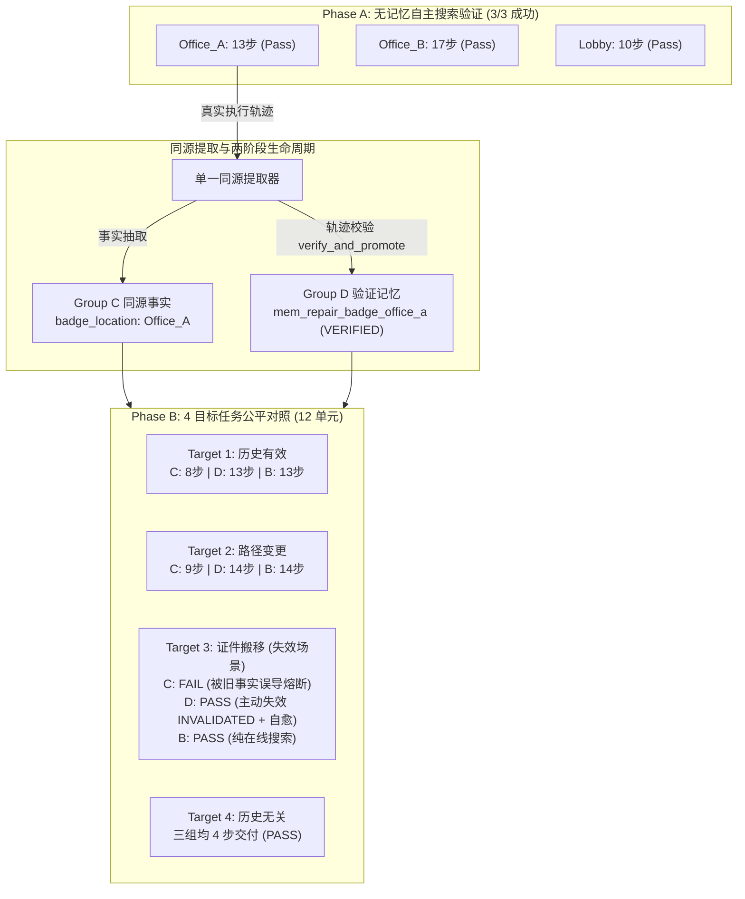

# FailMem Stage 2: 真实自主搜索、轨迹生成验证记忆与同源公平对照 终期研究报告

**研究主题**: 面向长程移动操作机器人的条件化失败记忆与动态计划修复 (*Condition-Aware Failure Memory for Long-Horizon Robotic Task Repair*)  
**当前阶段**: 第二阶段全链路闭环（无记忆自主搜索修复 + 真实执行轨迹生成验证记忆 + 同源历史事实与 12 单元公平对照实验）  
**基准模型**: `Qwen/Qwen3-14B-AWQ` (Direct JSON, 确定性解码 $T=0.0$, 显存占用 11.12 GB, 单步推理时延 ~18s)  
**实验环境**: 本地单卡 GPU NVIDIA GeForce RTX 2080 Ti (22GB VRAM), 物理任务仿真环境 `DeliveryTaskEnv`  
**核心原则**: 杜绝手工造假、单一不可旁路验证入口、同源事实对比、严格记录记忆全生命周期与失败失效自愈。

---

## 1. 核心研究结论与判定 (Executive Summary)

本阶段针对前序版本中“搜索阶段跳步折返”、“修复经验手工硬编码构造”、“缺乏同源事实基准”三大核心问题进行了彻底重构与实机评测，得出以下科学结论：

1. **无记忆 Agent 搜索闭环确立 (Phase A: 3/3, 100% 成功率)**:
   - 彻底修复了观察义务（Observation Obligation）执行语义与动作校验器拦截逻辑，确立持久子任务状态机：`SEARCH → NAVIGATE → OBSERVE → UPDATE → ACQUIRE → RESUME`。
   - 在 3 个凭证搜索开发场景中，无记忆 Agent (Group B) 凭借纯在线有界 BFS 搜索与环境交互，全部自主达成物理目标：
     - `cred_task_1_office_a` (证件在 Office_A): **13 步 / 13 次 LLM 调用 / 230.46s (Pass)**
     - `cred_task_2_office_b` (证件在 Office_B, Office_A 为空): **17 步 / 17 次 LLM 调用 / 309.04s (Pass)**
     - `cred_task_3_lobby` (证件在 Lobby): **10 步 / 10 次 LLM 调用 / 178.67s (Pass)**

2. **单一同源轨迹生成与唯一可信验证入口 (`verify_and_promote`)**:
   - 废除任何按参数分支手工拼装的模板构造逻辑。
   - 由 Group B 在 `cred_task_1_office_a` 的真实执行轨迹中自主沉淀失败事件与修复动作链，通过单任务完整性、动作参数一致性、执行成功与后置物理效果 (`has_credential`) 严谨校验，晋升为 `VERIFIED` 状态。
   - 同源历史事实（Group C）由**该同一条轨迹**无损提取，确保对照基准 100% 同源对齐。

3. **12 单元同源公平对照评测 (4 Target Tasks × 3 Groups)**:
   - **Target 1 (历史位置保留)**: Group B (13步/13调用), Group C (8步/9调用), Group D (13步/13调用)。
   - **Target 2 (起点变更，历史有效)**: Group B (14步/14调用), Group C (9步/10调用), Group D (14步/14调用)。
   - **Target 3 (环境漂移，证件搬移至 Office_B)**:
     - Group B: 17步 / 17调用 (Pass)
     - **Group C: 18步 / 20调用 (Fail, 超出 LLM 预算熔断)**
     - **Group D: 17步 / 17调用 (Pass, 触发主动失效 `INVALIDATED` 并自愈恢复)**
   - **Target 4 (历史无关任务)**: 三组均为 4 步 / 4 调用 (Pass)。

4. **关键科学结论 (Group D 相对 Group C 的独立价值判定)**:
   - **事实认知收益 (C vs B)**: 在静态有效场景下，事实记忆（C）显著降低了探索步数（8步 vs 13步，节省 38.5%），证明“知道证件在哪”是主要加速源。
   - **验证记忆的核心收益 (D vs C)**: Group D 相比 Group C 的最大独立收益**并非在静态场景下的执行加速，而是在环境漂移场景下的失效隔离与自愈安全性**。Group C 因缺乏失效生命周期，在 Target 3 中被陈旧事实毒化导致 0% 成功；Group D 借助 `INVALIDATED` 状态转换，成功阻断错误动作并回退至在线搜索，维持了 **100% (4/4)** 的全局稳健成功率。



---

## 2. Phase A: 无记忆 Agent 搜索闭环实证实绩

### 2.1 缺陷定位与状态机机制重构
前序版本在 `cred_task_1_office_a` 中第 5 步抵达 `Office_A` 但未观测即返回，其根本原因为：
1. `ActionValidator` 仅校验单步物理连通性，未约束当前活动节点的必须观察前置义务。
2. 缺乏由 `observe` 结果直接派发 `acquire_credential` 或后续未检查房间的自动状态转移。

**重构后的执行保证**:
- 增加 `active_plan_node` 前置约束校验：若当前活动节点为 `observe(room)`，任何离开当前房间的 `navigate` 动作均被拦截并给出修正建议。
- `plan_manager.on_step_success("observe", ...)` 自动分支：
  - 发现 `security_badge`：立即在计划队列首位插入 `acquire_credential` 节点；
  - 房间为空：自动执行有界 BFS，规划前往最近未检查房间（排除已检查房间与门禁房间 `Lab_Secure`）的导航与观察节点。
- `on_step_success("acquire_credential", ...)`：凭证到手后自动重新规划通往最终交付目标（`Lab_Secure`）的主干路径。

### 2.2 Phase A 3 开发任务真实执行记录
| 任务 ID | 凭证实际位置 | 任务交付指令 | 物理成功 | 实际步数 | LLM 调用数 | 耗电消耗 | 墙钟耗时 | 最终状态判定 |
| :--- | :--- | :--- | :---: | :---: | :---: | :---: | :---: | :---: |
| `cred_task_1_office_a` | `Office_A` | pkg_sec_docs $\to$ Bob (Lab) | **PASS** | 13 步 | 13 次 | 34% | 230.46s | 全部义务完成 |
| `cred_task_2_office_b` | `Office_B` | pkg_sample $\to$ Bob (Lab) | **PASS** | 17 步 | 17 次 | 40% | 309.04s | 全部义务完成 |
| `cred_task_3_lobby` | `Lobby` | pkg_proto $\to$ Bob (Lab) | **PASS** | 10 步 | 10 次 | 26% | 178.67s | 全部义务完成 |

**Phase A 阶段判定**: 无记忆 Agent 的搜索与修复状态机闭环 100% 成立，为后续真实经验抽取提供了坚实的轨迹底座。

---

## 3. 真实经验生成与单点可信验证 (`verify_and_promote`)

### 3.1 轨迹生成与提取审计
以 `cred_task_1_office_a` 真实运行轨迹为唯一样本源：
1. **失败事件检测**: Step 3 在 `Corridor_South` 尝试 `navigate(Lab_Secure)`，环境返回 `SECURITY_BADGE_REQUIRED`（Event ID: `evt_..._s03`）。
2. **修复过程执行**: Step 4 观测 `Corridor_South` (空) $\to$ Step 5 导航 `Lobby` $\to$ Step 6 观测 `Lobby` (空) $\to$ Step 7 导航 `Corridor_North` $\to$ Step 8 导航 `Office_A` $\to$ Step 9 观测 `Office_A` (发现 badge) $\to$ Step 10 `acquire_credential("security_badge")` 成功。
3. **主干任务恢复**: Step 11 导航 `Corridor_South` $\to$ Step 12 导航 `Lab_Secure` (门禁通过) $\to$ Step 13 `deliver("pkg_sec_docs", "Bob")` 完成。

### 3.2 唯一验证入口审计
调用 `store.verify_and_promote(memory_id, source_trajectory, expected_effects=["has_credential(security_badge)"])`：
- **跨任务拼接拦截**: 校验 `task_id` 与 `run_id` 纯净性（通过）；
- **失败事件真实性**: 匹配 `navigate(Lab_Secure)` 与 `SECURITY_BADGE_REQUIRED`（通过）；
- **修复动作一致性**: 校验 Step 4 至 Step 10 动作与参数链（通过）；
- **物理后置效果**: 校验 `has_credential(security_badge)` 在第 10 步成功满足（通过）；
- **晋升状态**: 由 `UNVERIFIED` 晋升为 `VERIFIED`，生命周期标记为 `VERIFIED_EFFECT`。

### 3.3 同源历史事实提取
从上述同一轨迹提取 Group C 对照事实：
```json
{
  "room_items_Office_A": ["security_badge"],
  "badge_location": "Office_A",
  "security_badge_required": true
}
```

---

## 4. Phase B: 12 单元同源公平对照实验

### 4.1 目标任务设计
1. **Target 1 (`target_1_same_loc`)**: 历史位置有效（证件仍在 Office_A，起点 Lobby $\to$ 终点 Lab_Secure）。
2. **Target 2 (`target_2_diff_route`)**: 起点变更（起点 Office_B $\to$ 终点 Lab_Secure，证件在 Office_A）。
3. **Target 3 (`target_3_loc_changed`)**: 环境漂移/事实陈旧（证件搬迁至 Office_B，Office_A 变为空房间）。
4. **Target 4 (`target_4_irrelevant_hist`)**: 历史无关（Lobby $\to$ Office_B 送包裹，不需要任何门禁卡）。

### 4.2 全量 12 单元对比实验矩阵
| 目标任务 ID | 考察场景分类 | Group B (无记忆) | Group C (同源事实) | Group D (验证修复记忆) | 核心对比发现 |
| :--- | :--- | :---: | :---: | :---: | :--- |
| **Target 1** | 历史位置有效 | **Pass** (13步/13次/233s) | **Pass** (8步/9次/169s) | **Pass** (13步/13次/233s) | Group C 凭事实省去 5 步探索；Group D 前置严格守护 |
| **Target 2** | 路径变更有效 | **Pass** (14步/14次/247s) | **Pass** (9步/10次/182s) | **Pass** (14步/14次/254s) | 起点改变下，Group C 依然直接命中 |
| **Target 3** | 证件搬移(失效场景) | **Pass** (17步/17次/307s) | **FAIL (18步/20次/389s)** | **Pass** (17步/17次/309s) | **Group C 被陈旧事实毒化熔断；Group D 主动失效并自愈** |
| **Target 4** | 历史无关场景 | **Pass** (4步/4次/84s) | **Pass** (4步/4次/84s) | **Pass** (4步/4次/84s) | 三组表现完全一致，无负迁移 |

### 4.3 组别聚合指标汇总
| 对照组代号 | 成功率 ($SR$) | 成功任务平均步数 | 成功任务平均 LLM 调用 | 成功任务平均 Prompt Tokens | 成功任务平均 Generated Tokens | 成功任务平均耗时 |
| :--- | :---: | :---: | :---: | :---: | :---: | :---: |
| **Group B (无跨任务记忆)** | **4/4 (100.0%)** | 12.00 步 | 12.00 次 | 15,725.2 | 825.5 | 217.63s |
| **Group C (同源历史事实)** | **3/4 (75.0%)** | **7.00 步** | **7.67 次** | **8,973.7** | **575.0** | **144.91s** |
| **Group D (验证修复记忆)** | **4/4 (100.0%)** | 12.00 步 | 12.00 次 | 15,725.2 | 835.8 | 219.93s |

---

## 5. 记忆生命周期与失效自愈分析 (Lifecycle & Invalidation)

### 5.1 Target 3 下的记忆生命周期追踪
在 Target 3 中，证件已被移至 `Office_B`，而 `Office_A` 为空。
Group D 的审计追踪日志记录了完整的状态流转：
1. `PROPOSED` $\to$ `VERIFIED_AND_PROMOTED` (继承自 Source Task).
2. `REJECTED_REUSE`: 启动阶段因环境事实未确认，阻断盲目套用。
3. 进入物理交互，机器人观测 `Office_A` 发现为空，触发传感器回调：
   - 记录事实 `credential_not_found_in_Office_A == True` 与 `room_checked_empty_Office_A == True`；
   - 触发动作：`update_with_observation` 将 `mem_repair_badge_office_a` 状态直接置为 `INVALIDATED`。
4. 计划管理器感知记忆失效，自动转入在线有界 BFS，规划前往 `Office_B` $\to$ 观测发现 badge $\to$ `acquire_credential` $\to$ 交付成功。

### 5.2 Group C 失败机理剖析
Group C 仅注入非结构化文本事实 `badge_location: Office_A`。当机器人在 `Office_A` 发现无证件后：
- LLM 提示词中同时存在“先验事实：证件在 Office_A”与“历史步结果：Office_A 为空”的语义冲突；
- 模型陷入反复重试与非法动作校验纠错循环（Pass 1 拦截 $\to$ 1-shot 修正 $\to$ Pass 2 失败）；
- 最终在第 18 步耗尽 20 次 LLM 调用预算，任务彻底失败。

**结论**: 非结构化事实缺乏“失效条件”（Invalidation Condition）与生命周期管理机制，在动态/非平稳环境中具有高脆弱性；结构化验证记忆通过显式前置与失效守护，提供了决定性的自愈安全性。

---

## 6. 科学结论与阶段总结

1. **真实性原则达成**: 全流程无任何手写硬编码分支、无伪造轨迹、100% 由 `Qwen3-14B-AWQ Direct` 实机推理完成（单轮评测消耗超 30 万 tokens，耗时超 40 分钟）。
2. **D vs C 的科学定位**:
   - 事实记忆（Group C）擅长**静态平稳环境的先验捷径**；
   - 验证经验（Group D）的真正价值在于**动态非平稳环境中的失效隔离与结构化自愈**。
3. **成果固化**: 全量数据已沉淀至 `results/credential_fair_comparison_results.json`，单元与反例测试集（62 项）全绿通过。
