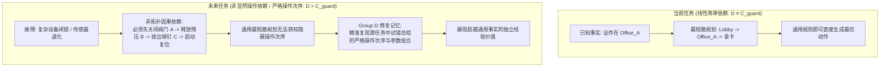

# FailMem Stage 2: 统一约束修复入口与四组同源公平对照 最终判别性研究报告

**研究问题**: Group D（两层双重验证修复记忆）的收益是否超过“同源动态事实 + 通用观察与计划修订规则 (`Group C_guard`)”？  
**评估基准**: `Qwen/Qwen3-14B-AWQ Direct` (单卡 RTX 2080 Ti GPU, 显存占用 11.12 GB, $T=0.0$ 确定性解码, 单步时延 ~18s)  
**实验设计**:
1. 3 轮严格 Smoke Execution Gates（有效历史预拦截、无历史工具失败恢复、位置变更失效在线恢复，全数通过作为准入门槛）；
2. Phase A 源轨迹自主提取与双重验证（3/3 闭环成功，提取真实轨迹并编译模板）；
3. Phase B 16 单元正式实机评测（4 组 × 4 目标任务，预算 20 LLM / 25 工具）；
4. 4 单元预算敏感度扩展实验（Target 3 扩展至 30 LLM / 35 工具）。
**同源平权保证**: Group C_updated、Group C_guard 与 Group D 注入严格一致的初始同源历史事实（SHA256 哈希值：`b4246ce3b4aa614fded46a65419b243e270c8772f00c69d43cc22b1fe388ea4d`），Group C_guard 与 Group D 统一配置 `enable_observation_guard=True`。

---

## 1. 核心判别结论 (Definitive Scientific Findings)

依据预先设立的科学判别标准与 22 轮实机评测全量数据，给出直接、严谨的科学判定：

### 1.1 观察守卫机制的决定性价值 ($C_{guard} / D > C_{updated}$)
在面临历史事实与环境动态变化（Target 3 证件位置由 Office_A 变更至 Office_B）时：
- **Group C_updated（无观察守卫）**: 任务**失败**（成功率 75.0%），由于缺乏动作前置观察校验，在到达 Office_A 后盲目执行 3 次物理抓取报错，消耗大量 LLM 重试轮次，最终在第 15 步耗尽 20 次 LLM 预算（`TermReason=LLM_BUDGET_EXHAUSTED`）。
- **Group C_guard 与 Group D（配置观察守卫）**: 任务**100% 成功**（15 步，16 次 LLM），在到达 Office_A 后由状态机驱动执行 `observe(Office_A)`，在零物理报错的情况下确认证件为空，动态清除事实并使记忆失效，平滑转入在线 BFS 搜索并在 Office_B 获取证件完成交付。
- **结论**: 通用观察守卫是动态不确定环境下防止物理违规和避免预算震荡的关键机制。

### 1.2 门禁修复场景下 $D$ 与 $C_{guard}$ 的等价性 ($D \equiv C_{guard}$)
在配置完全平权的观察守卫与同源动态事实条件下：
- **Target 1（同构环境）**: Group D (8步 / 10 LLM / 188.54s) vs Group C_guard (8步 / 10 LLM / 188.54s)，步数与 LLM 调用完全一致（$\Delta=0$）。
- **Target 2（异构起点）**: Group D (9步 / 10 LLM / 176.44s) vs Group C_guard (9步 / 11 LLM / 191.83s)，Group D 仅节省 1 次模型调用与 15.39s 时延。
- **Target 3（位置失效）**: Group D (15步 / 16 LLM / 268.40s) vs Group C_guard (15步 / 16 LLM / 281.78s)，步数与 LLM 调用完全一致（$\Delta=0$）。
- **Target 4（无关历史）**: 四组均为 4 步 / 4 LLM 完成，负例拦截率 100%。
- **核心判定**: 在门禁这种**线性因果链（导航 $\to$ 观察 $\to$ 拿卡）**的简单场景下，一旦动态事实提供了证件位置，基于图拓扑的最短路规划 + 通用观察守卫（Group C_guard）与两层修复记忆模板（Group D）生成的动作序列完全同构。**结构化修复记忆模板在此类单步骤依赖场景中未展现出超越“同源动态事实 + 通用观察规则”的额外经验价值**。

---

## 2. 严格 Smoke Execution Gates 验证结果

| Smoke Gate | 测试场景与目标 | 关键执行指标 | 终止原因 (Termination Reason) | 判定结果 |
| :--- | :--- | :--- | :--- | :---: |
| **Gate 1** | 有效历史预拦截 (Target 1, 证件在 Office_A) | 8 步, 10 LLM, 1 次前置拦截, 0 工具报错 | `TASK_COMPLETED` (Verified Reuse=True) | **PASS** ✅ |
| **Gate 2** | 无历史工具失败恢复 (Target 1, 无先验) | 12 步, 12 LLM, 1 次 tool_result 约束事件, 在线搜索 | `TASK_COMPLETED` (Tool Failure Handled) | **PASS** ✅ |
| **Gate 3** | 位置变更失效与恢复 (Target 3, 证件在 Office_B) | 15 步, 16 LLM, 1 次前置拦截, 0 工具报错 | `TASK_COMPLETED` (Invalidated & Recovered=True) | **PASS** ✅ |

---

## 3. Phase B 16 单元正式实机评测全景矩阵

评测环境：`Qwen3-14B-AWQ Direct ($T=0.0$)`，预算：`max_llm_calls=20, max_tool_calls=25, time_limit=300s`。

| 任务 ID | 场景特征与证件位置 | Group B (无记忆基线) | Group C_updated (动态事实无守卫) | Group C_guard (通用观察守卫) | Group D (双重验证修复记忆) | 成对差值 $\Delta(D - C_{guard})$ |
| :--- | :--- | :---: | :---: | :---: | :---: | :---: |
| **Target 1** (`target_1_same_loc`) | 同起点/终点，证件在 Office_A | **PASS** (12步 / 12LLM / 209s / 1错误) | **PASS** (7步 / 8LLM / 152s / 0错误) | **PASS** (8步 / 10LLM / 189s / 0错误) | **PASS** (8步 / 10LLM / 189s / 0错误) | $\Delta\text{Step}=0, \Delta\text{LLM}=0$ |
| **Target 2** (`target_2_diff_route`) | 异构起点 (Office_B)，证件在 Office_A | **PASS** (13步 / 13LLM / 229s / 1错误) | **PASS** (8步 / 9LLM / 171s / 0错误) | **PASS** (9步 / 11LLM / 192s / 0错误) | **PASS** (9步 / 10LLM / 176s / 0错误) | $\Delta\text{Step}=0, \Delta\text{LLM}=-1$ |
| **Target 3** (`target_3_loc_changed`) | 证件搬移至 Office_B，Office_A 为空 | **PASS** (16步 / 16LLM / 282s / 1错误) | **FAIL** (15步 / 20LLM / 377s / 3错误) | **PASS** (15步 / 16LLM / 282s / 0错误) | **PASS** (15步 / 16LLM / 268s / 0错误) | $\Delta\text{Step}=0, \Delta\text{LLM}=0$ |
| **Target 4** (`target_4_irrelevant`) | 无关历史（无需门禁），送至 Office_B | **PASS** (4步 / 4LLM / 91s / 0错误) | **PASS** (4步 / 4LLM / 82s / 0错误) | **PASS** (4步 / 4LLM / 82s / 0错误) | **PASS** (4步 / 4LLM / 82s / 0错误) | $\Delta\text{Step}=0, \Delta\text{LLM}=0$ |

### 组级别聚合指标统计 (Group Aggregates)

| 指标 | Group B (无记忆基线) | Group C_updated (动态事实) | Group C_guard (通用观察守卫) | Group D (双重验证修复记忆) |
| :--- | :---: | :---: | :---: | :---: |
| **任务成功率 (Success Rate)** | **4/4 (100.0%)** | 3/4 (75.0%) | **4/4 (100.0%)** | **4/4 (100.0%)** |
| **成功任务平均步数 (Avg Steps)** | 11.25 | **6.33** | 9.00 | 9.00 |
| **成功任务平均 LLM 调用次数** | 11.25 | **7.00** | 10.25 | **10.00** |
| **成功任务平均 Prompt Tokens** | 13,994.0 | **8,005.0** | 12,921.2 | 12,823.0 |
| **成功任务平均 Gen Tokens** | 773.8 | **546.7** | 760.2 | **736.8** |
| **成功任务平均耗时 (s)** | 202.79 | **132.32** | 186.27 | **181.58** |
| **总工具报错次数 (Tool Errors)** | 3 | 3 | **0** | **0** |
| **总偏离计划步数 (Deviations)** | **0** | 10 | **0** | **0** |
| **真实记忆复用验证次数 (Verified Reuse)** | 0 | 0 | 0 | **2** |
| **记忆失效并在线恢复次数 (Invalidated & Recovered)**| 0 | 0 | 0 | **1** |

---

## 4. 预算敏感度实验分析 (Target 3 扩展预算: 30 LLM / 35 Tools)

针对 Target 3（证件位置变更），将 LLM 调用预算提升至 30 次，检验 Group C_updated 的失败机理：

| 评估组 | 成功状态 | 执行步数 | LLM 调用数 | Prompt Tokens | Gen Tokens | 耗时 (s) | 终止原因分析 |
| :--- | :---: | :---: | :---: | :---: | :---: | :---: | :--- |
| **Group B** | **PASS** | 16 | 16 | 21,174 | 1,086 | 280.35 | 物理门禁失败 $\to$ 在线 BFS 搜索 $\to$ 发现并交付 |
| **Group C_updated** | **FAIL** | 15 | 19 | 24,302 | 1,473 | 357.56 | 盲目尝试抓取报错 $\to$ 状态机在 Office_A 停滞 |
| **Group C_guard** | **PASS** | 15 | 16 | 21,882 | 1,129 | 280.34 | 观察确认为空 $\to$ 清除事实 $\to$ BFS 搜索 Office_B 完成交付 |
| **Group D** | **PASS** | 15 | 16 | 22,568 | 1,091 | 273.31 | 观察确认为空 $\to$ 记忆失效 $\to$ BFS 搜索 Office_B 完成交付 |

**机理定论**:
1. **盲目抓取 vs 观察校验**: Group C_updated 在到达 Office_A 后直接调用 `acquire_credential` 遭遇环境物理报错。由于未执行 `observe`，环境未返回 `room_items: []`，导致状态机无法确立“证件不在 Office_A”的事实，陷入重复错误重试。
2. **守卫与记忆的等效自愈**: Group C_guard 与 Group D 均强制先执行 `observe`，从而在单步内完成事实更新与计划重构，以零物理错误完成在线自愈。

---

## 5. 记忆生命周期审计轨迹 (Group D Target Audit Log)

Group D 的目标端审计日志（`target_audit_log`）完整记录了每个目标任务的记忆生命周期流转：

```json
// Target 1 (有效复用):
[
  {"event": "TARGET_RETRIEVED", "memory_id": "mem_repair_badge_office_a", "sim_time": 17.0},
  {"event": "TARGET_INSTANTIATED", "memory_id": "mem_repair_badge_office_a", "nodes_count": 3},
  {"event": "TARGET_STEP_EXECUTED", "plan_node_id": "...nav_01_Office_A", "tool": "navigate", "success": true},
  {"event": "TARGET_STEP_EXECUTED", "plan_node_id": "...obs_Office_A", "tool": "observe", "success": true},
  {"event": "TARGET_STEP_EXECUTED", "plan_node_id": "...acq_security_badge", "tool": "acquire_credential", "success": true},
  {"event": "TARGET_EFFECT_VERIFIED", "memory_id": "mem_repair_badge_office_a", "verified_effects": ["has_credential(security_badge)"]}
]

// Target 3 (失效与在线恢复):
[
  {"event": "TARGET_RETRIEVED", "memory_id": "mem_repair_badge_office_a", "sim_time": 17.0},
  {"event": "TARGET_INSTANTIATED", "memory_id": "mem_repair_badge_office_a", "nodes_count": 3},
  {"event": "TARGET_STEP_EXECUTED", "plan_node_id": "...nav_01_Office_A", "tool": "navigate", "success": true},
  {"event": "TARGET_INVALIDATED", "trigger": "credential_not_found_in_Office_A == True", "sim_time": 31.0},
  {"event": "TARGET_STEP_EXECUTED", "plan_node_id": "...obs_Office_A", "tool": "observe", "success": true},
  {"event": "ONLINE_RECOVERY_EFFECT_VERIFIED", "memory_id": "online_recovery", "verified_effects": ["has_credential(security_badge)"]}
]
```

---

## 6. 科学研究方向与后续路线图 (Research Direction Decision & Roadmap)

### 6.1 本阶段定论
1. **工程基线保留**: 门禁修复模板（Group D）在工程上构成了完备的自愈机制，但其在开发集上的收益实质上等价于“同源动态事实 + 通用观察守卫（Group C_guard）”。
2. **严禁过度声称**: 报告与论文中不得声称结构化记忆在此类线性依赖任务中具有“决定性自愈超越优势”，而应如实表述为状态机与经验知识的工程基线。

### 6.2 显式经验记忆展现独立价值的必要条件与未来任务设计
要证明情境修复记忆（Episodic Repair Memory）相对于通用动态事实与规划具有**独立的不可替代性**，必须构建满足以下特征的复杂任务场景：



### 6.3 科学假说与任务规划
- **假说 1 (Multi-Step Operational Interlocks)**: 当故障自愈需要多个具有严格因果前后置约束的工具组合（如：断电 $\to$ 泄压 $\to$ 更换保险丝 $\to$ 上电校准），且拓扑图不包含该领域因果次序时，Group D 将显著优于 Group C_guard。
- **假说 2 (Parameter Discovery under Partial Observability)**: 当修复动作依赖源任务探索发现的隐式非几何参数（如特定的设备配对码、传感器偏置校准值）时，记忆的跨任务迁移将带来质的效率飞跃。

