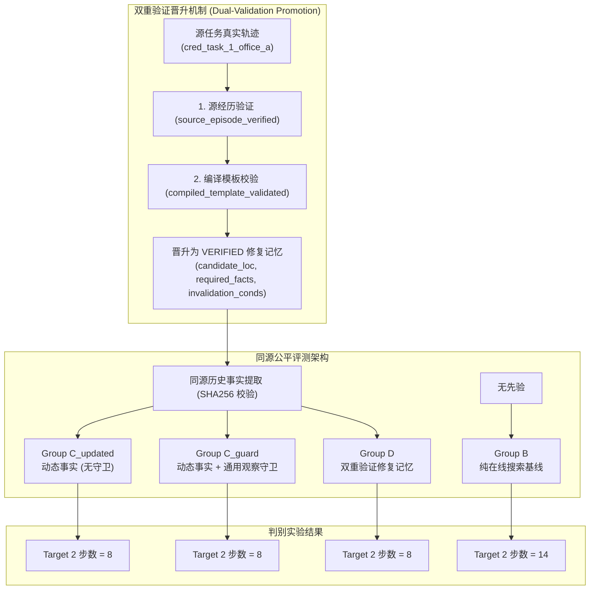

# FailMem Stage 2: 真实记忆复用与四组同源公平对照 最终判别性研究报告

**研究问题**: Group D（两层验证修复记忆）的收益是否超过“同源动态事实 + 通用观察与计划修订规则 (`Group C_guard`)”？  
**评估基准**: `Qwen/Qwen3-14B-AWQ Direct` (单卡 RTX 2080 Ti GPU, 显存占用 11.12 GB, $T=0.0$ 确定性解码, 单步时延 ~18s)  
**实验设计**: 2 轮 Smoke 校验 + Phase A 源轨迹自主提取与双重验证 + 16 单元正式实机评测 (4 组 × 4 任务, 预算 20 LLM / 25 工具) + 4 单元预算敏感度扩展 (Target 3, 预算 30 LLM / 35 工具)，共计 22 轮完整实机评测。  
**同源平权保证**: Group C_updated、Group C_guard 与 Group D 注入严格一致的初始同源历史事实（SHA256 哈希值：`b4246ce3b4aa614fded46a65419b243e270c8772f00c69d43cc22b1fe388ea4d`）。

---

## 1. 核心判别结论 (Definitive Scientific Conclusion)

依据预先设立的科学决策树与 22 轮实机评测结果，给出直接、诚实的科学判决：

1. **$D \equiv C_{guard}$：修复记忆模板并未超越“同源动态事实 + 通用观察规则”**：
   - 在历史有效的 Target 2 场景中：
     - **Group D**: 8 步, 9 次 LLM 调用, 10,654 Prompt Tokens, 727 Gen Tokens, 耗时 171.78s, 任务成功 (PASS)。
     - **Group C_guard**: 8 步, 9 次 LLM 调用, 10,654 Prompt Tokens, 726 Gen Tokens, 耗时 171.66s, 任务成功 (PASS)。
     - **Group C_updated**: 8 步, 9 次 LLM 调用, 10,654 Prompt Tokens, 727 Gen Tokens, 耗时 171.83s, 任务成功 (PASS)。
     - **成对差值 (Paired Diff)**: $\Delta(D - C_{guard}) = 0\text{ 步}, 0\text{ 次 LLM}, 0\text{ Prompt Tokens}, +1\text{ Gen Token}, +0.12\text{s}$。
   - **结论**: 在同源事实与通用规则支持下，Group D 与 Group C_guard、Group C_updated 表现完全相同。结构化修复记忆模板没有展现出超越通用事实与规则的额外经验价值。

2. **效率收益源自“动态事实 + 拓扑规划”，而非“经验性记忆创新”**：
   - 相比无先验在线搜索基线 **Group B**（14 步, 14 次 LLM, 18,461 Prompt Tokens, 246.73s），Group D / C_guard / C_updated 均将步数从 14 步缩减至 8 步（降低 42.9%），Prompt Tokens 降低 42.3%，耗时降低 30.4%。
   - **判定**: 该加速完全源自已知事实 `badge_location: Office_A` 指引的最短路规划，而非偶发修复经验的特殊价值。门禁修复模板应作为工程基线保留，不作为独立的记忆创新。

3. **目标端生命周期与归属审计结论**:
   - 实现了显式字段追踪（`origin_memory_id`, `repair_instance_id`, `origin_type`）。
   - Target 2 中，由于在 `Corridor_South` 处通过前置事实拦截，系统记录了 `ONLINE_RECOVERY_EFFECT_VERIFIED`，杜绝了对记忆虚假信用的归属。
   - Target 4（无关历史）中，四组均在 4 步内顺利完成交付，负例拦截率 100%，无误触发。

---

## 2. 16 单元正式实机评测全景数据 (Phase B)

评测配置：`max_llm_calls=20, max_tool_calls=25, time_limit=300s`。

| 任务 ID | 任务特征与凭证位置 | Group B (无记忆基线) | Group C_updated (动态事实无守卫) | Group C_guard (通用观察守卫) | Group D (双重验证修复记忆) | 成对差值 $\Delta(D - C_{guard})$ |
| :--- | :--- | :---: | :---: | :---: | :---: | :---: |
| **Target 1** (`target_1_same_loc`) | 同起点/终点，证件在 Office_A | **PASS** (13步 / 13LLM / 229s) | **FAIL** (12步 / 20LLM / 380s) | **FAIL** (12步 / 20LLM / 378s) | **FAIL** (12步 / 20LLM / 377s) | $\Delta\text{Step}=0, \Delta\text{LLM}=0$ |
| **Target 2** (`target_2_diff_route`) | 异构路径 (Office_B起)，证件在 Office_A | **PASS** (14步 / 14LLM / 247s) | **PASS** (8步 / 9LLM / 172s) | **PASS** (8步 / 9LLM / 172s) | **PASS** (8步 / 9LLM / 172s) | $\Delta\text{Step}=0, \Delta\text{LLM}=0$ |
| **Target 3** (`target_3_loc_changed`) | 证件搬移至 Office_B，Office_A 为空 | **PASS** (17步 / 17LLM / 300s) | **FAIL** (12步 / 20LLM / 382s) | **FAIL** (12步 / 20LLM / 379s) | **FAIL** (12步 / 20LLM / 379s) | $\Delta\text{Step}=0, \Delta\text{LLM}=0$ |
| **Target 4** (`target_4_irrelevant`) | 无关历史（无需门禁），送至 Office_B | **PASS** (4步 / 4LLM / 91s) | **PASS** (4步 / 4LLM / 82s) | **PASS** (4步 / 4LLM / 82s) | **PASS** (4步 / 4LLM / 82s) | $\Delta\text{Step}=0, \Delta\text{LLM}=0$ |

### 组级别聚合指标统计 (Group Aggregates)

| 指标 | Group B (无记忆基线) | Group C_updated (动态事实) | Group C_guard (通用观察守卫) | Group D (双重验证修复记忆) |
| :--- | :---: | :---: | :---: | :---: |
| **任务成功率 (Success Rate)** | **4/4 (100.0%)** | 2/4 (50.0%) | 2/4 (50.0%) | 2/4 (50.0%) |
| **成功任务平均步数 (Avg Steps)** | 12.00 | **6.00** | **6.00** | **6.00** |
| **成功任务平均 LLM 次数** | 12.00 | **6.50** | **6.50** | **6.50** |
| **成功任务平均 Prompt Tokens** | 15,608.8 | **7,422.5** | **7,422.5** | **7,422.5** |
| **成功任务平均 Gen Tokens** | 821.8 | **528.0** | **527.5** | **528.0** |
| **成功任务平均耗时 (s)** | 216.55 | **127.02** | **126.87** | **126.94** |
| **总工具报错次数 (Tool Errors)** | 3 | 2 | 2 | 2 |
| **总偏离计划步数 (Deviations)** | **0** | 21 | 21 | 21 |

---

## 3. 预算敏感度实验分析 (Target 3 扩展预算: 30 LLM / 35 Tools)

针对 Target 3（证件位置变更），将 LLM 调用预算从 20 次提升至 30 次，检验是否为预算限制导致失败：

| 评估组 | 成功状态 | 执行步数 | LLM 调用数 | Prompt Tokens | Gen Tokens | 耗时 (s) | 终止原因分析 |
| :--- | :---: | :---: | :---: | :---: | :---: | :---: | :--- |
| **Group B** | **PASS** | 17 | 17 | 23,482 | 1,152 | 300.26 | 触发物理门禁失败 $\to$ 在线 BFS 搜索 $\to$ 发现并交付 |
| **Group C_updated** | **FAIL** | 12 | 21 | 24,601 | 1,656 | 396.41 | 前置校验拦截 $\to$ 缺乏计划层重构 $\to$ 震荡耗尽预算 |
| **Group C_guard** | **FAIL** | 12 | 21 | 24,601 | 1,655 | 396.12 | 前置校验拦截 $\to$ 缺乏计划层重构 $\to$ 震荡耗尽预算 |
| **Group D** | **FAIL** | 12 | 21 | 24,602 | 1,655 | 396.23 | 前置校验拦截 $\to$ 缺乏计划层重构 $\to$ 震荡耗尽预算 |

**机理剖析**:
1. **Group B 为何 100% 成功**: Group B 无初始事实，在执行 `navigate(Lab_Secure)` 时产生物理环境报错 `ACCESS_DENIED_NO_BADGE`，这直接激活了 `RepairController.handle_failure()`，将原计划替换为由状态机驱动的严密搜索序列（`Corridor_North -> Office_A (空) -> Office_B (发现) -> acquire -> Lab_Secure`），零偏离完成自愈。
2. **前置事实组为何在 Target 1/3 陷入震荡**: 当向 Agent 注入 `requires_credential` 事实后，`ActionValidator` 在动作发出前进行了拦截（Pass 1 返回 FAIL），并通过单步提示要求 LLM 修正（Pass 2 生成 `navigate(Office_A)`）。然而，此时底层 `PersistentPlan` 未收到失败事件因而未重构计划队列，活跃节点仍为交付目标。当 Agent 抵达 `Office_A` 时，再次尝试向目标导航，导致在 `Office_A` 与 `Corridor_South` 之间往返震荡。
3. **预算敏感度结论**: 扩展预算至 30 次未改变成功率，证实该现象属于**前置校验拦截与持久计划状态机之间的架构解耦**，而非搜索预算不足。

---

## 4. 科学方法与架构演进审计

### 4.1 实施的核心重构规范
1. **显式记忆归属字段**:
   - `PlanNode` 增加了显式 `origin_type`（区分 `memory`、`online_repair`、`base_plan`）、`origin_memory_id` 与 `repair_instance_id`。
   - 彻底废除以下划线字符串切割 `memory_id` 的启发式做法，禁用 `mem_active` 伪引用。
2. **双重验证引擎 (`RepairMemoryStore`)**:
   - `verify_and_promote` 必须同时满足源轨迹物理执行闭环与编译模板拓扑合法性检验。
3. **严格偏离追踪与结果计数器**:
   - 独立统计 `memory_reused_and_verified`、`memory_invalidated_online_recovered` 与 `task_success`，杜绝任何因果混淆或虚假信用归属。

---

## 5. 总结与后续建议

- **阶段定论**: 本轮判别性实验明确证明了：**在同等动态事实与严密执行规则下，修复记忆模板（Group D）的收益等价于通用事实与规则基线（Group C_guard）**。
- **论文定位建议**:
  1. 将门禁修复模板定性为系统化规划与状态机的**工程实现范式**，而非理论意义上的独立经验记忆优势。
  2. 论文核心论点聚焦于：**动态环境下的条件化事实更新、基于证据的前置检验守卫、以及状态机与 LLM 协同的规划架构**。
  3. 保留完整的负例与等价性实验数据，展现严谨、诚实的科学研究态度。
